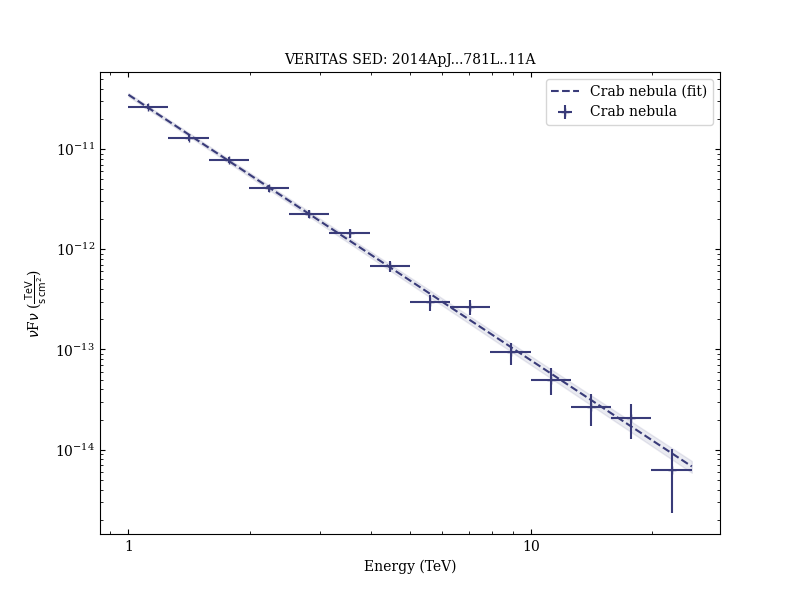
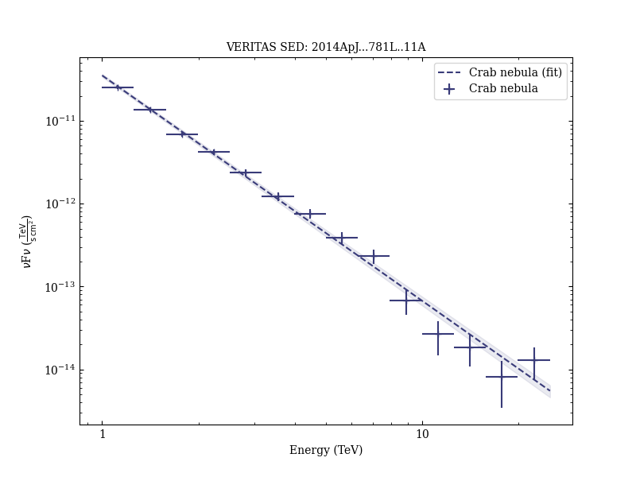

# A Search for Enhanced Very High Energy Gamma-Ray Emission from the 2013 March Crab Nebula Flare

Reference:
Aliu, E. et al. (The VERITAS Collaboration), The Astrophysical Journal, 781, L11 (2014)

- ADS: [2014ApJ...781L..11A](http://adsabs.harvard.edu/abs/2014ApJ...781L..11A)
- DOI: [10.1088/2041-8205/781/1/L11](https://doi.org/10.1088/2041-8205/781/1/L11)

## Crab nebula (VER J0534+220)
### Data files

- observation data: [VER-000025-1.yaml](VER-000025-1.yaml)  [VER-000025-2.yaml](VER-000025-2.yaml)
- spectral data: [VER-000025-sed-1.ecsv](VER-000025-sed-1.ecsv)  [VER-000025-sed-2.ecsv](VER-000025-sed-2.ecsv)
- light-curve data: [VER-000025-lc.ecsv](VER-000025-lc.ecsv)
- observation data and fit results: [VER-000025-1.yaml](VER-000025-1.yaml)  [VER-000025-2.yaml](VER-000025-2.yaml)

### Figures

