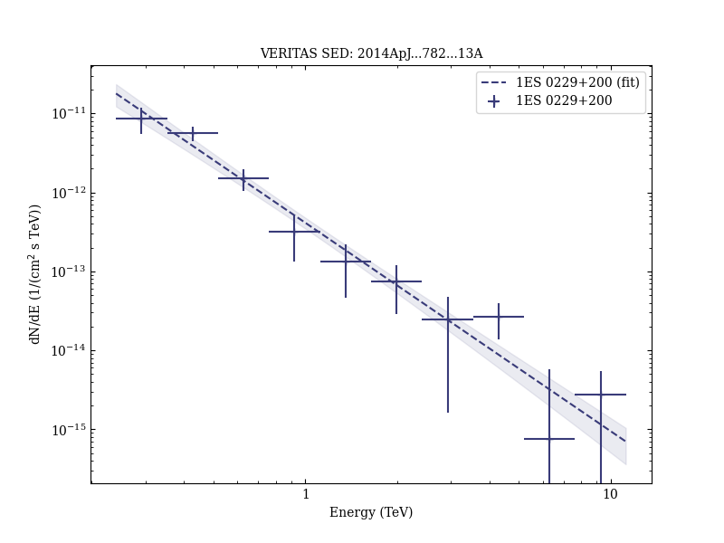
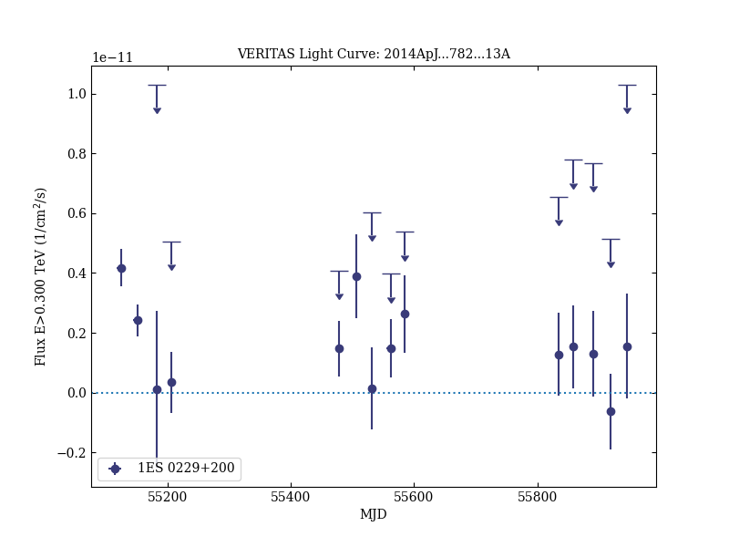
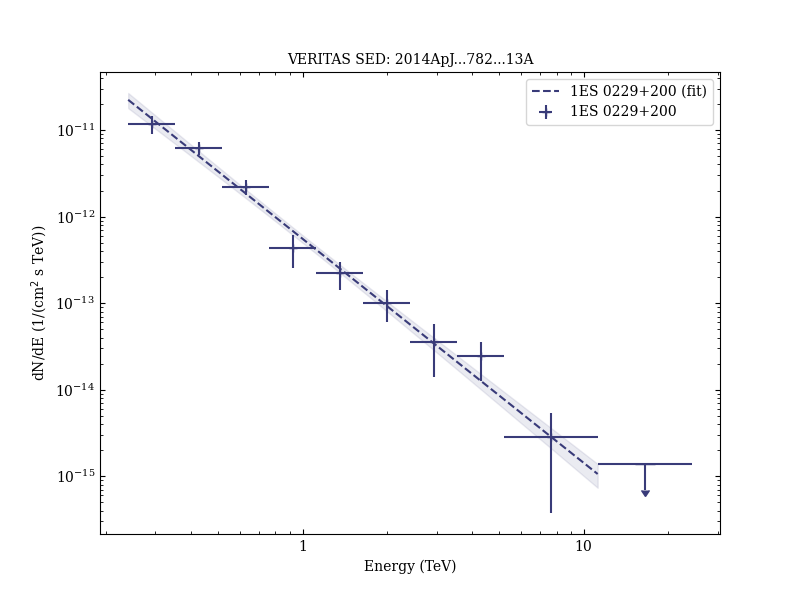

# A Three-year Multi-wavelength Study of the Very-high-energy γ-Ray Blazar 1ES 0229+200

Reference:
Aliu, E. et al. (The VERITAS Collaboration), The Astrophysical Journal, 782, 13 (2014)

- ADS: [2014ApJ...782...13A](http://adsabs.harvard.edu/abs/2014ApJ...782...13A)
- DOI: [10.1088/0004-637X/782/1/13](https://doi.org/10.1088/0004-637X/782/1/13)

## 1ES 0229+200 (VER J0232+202)
### Data files

- observation data: [VER-000013.yaml](VER-000013.yaml)  
- spectral data: [VER-000013-sed-1.ecsv](VER-000013-sed-1.ecsv)  [VER-000013-sed-2.ecsv](VER-000013-sed-2.ecsv)  [VER-000013-sed-3.ecsv](VER-000013-sed-3.ecsv)  
- light-curve data: [VER-000013-lc-1.ecsv](VER-000013-lc-1.ecsv)  [VER-000013-lc-2.ecsv](VER-000013-lc-2.ecsv)  
- observation data and fit results: [VER-000013.yaml](VER-000013.yaml)  

### Figures

