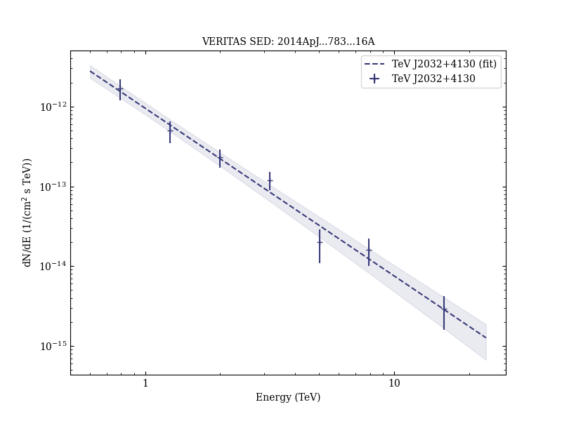

# Observations of the Unidentified Gamma-Ray Source TeV J2032+4130 by VERITAS

Reference:
Aliu, E. et al. (The VERITAS Collaboration), The Astrophysical Journal, 783, 16 (2014)

- ADS: [2014ApJ...783...16A](http://adsabs.harvard.edu/abs/2014ApJ...783...16A)
- DOI: [10.1088/0004-637X/783/1/16](https://doi.org/10.1088/0004-637X/783/1/16)

### Data tables

- data tables: [VER-000146-extension-table-1.ecsv](VER-000146-extension-table-1.ecsv)## TeV J2032+4130 (VER J2031+415)
### Data files

- observation data: [VER-000146.yaml](VER-000146.yaml)
- spectral data: [VER-000146-sed.ecsv](VER-000146-sed.ecsv)
- observation data and fit results: [VER-000146.yaml](VER-000146.yaml)
- FITS data: [VER-000146-excess-skymap.fits](VER-000146-excess-skymap.fits)  [VER-000146-signif-skymap.fits](VER-000146-signif-skymap.fits)

### Figures

