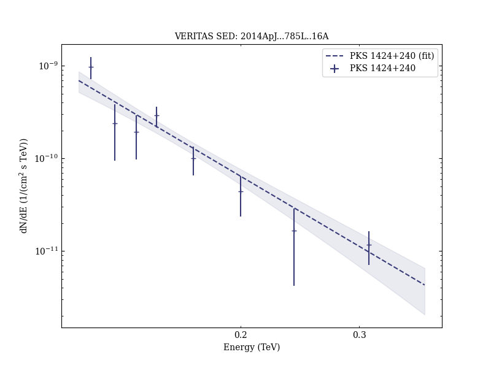
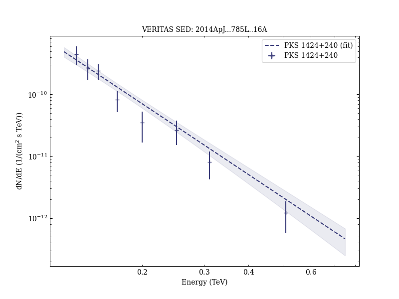

# Deep Broadband Observations of the Distant Gamma-Ray Blazar PKS 1424+240

Reference:
Archambault, S. et al. (The VERITAS Collaboration), The Astrophysical Journal, 785, L16 (2014)

- ADS: [2014ApJ...785L..16A](http://adsabs.harvard.edu/abs/2014ApJ...785L..16A)
- DOI: [10.1088/2041-8205/785/1/L16](https://doi.org/10.1088/2041-8205/785/1/L16)

## PKS 1424+240 (VER J1427+237)
### Data files

- observation data: [VER-000067-1.yaml](VER-000067-1.yaml)  [VER-000067-2.yaml](VER-000067-2.yaml)  [VER-000067-3.yaml](VER-000067-3.yaml)  
- spectral data: [VER-000067-sed-1.ecsv](VER-000067-sed-1.ecsv)  [VER-000067-sed-2.ecsv](VER-000067-sed-2.ecsv)  [VER-000067-sed-3.ecsv](VER-000067-sed-3.ecsv)  
- light-curve data: [VER-000067-lc.ecsv](VER-000067-lc.ecsv)  
- observation data and fit results: [VER-000067-1.yaml](VER-000067-1.yaml)  [VER-000067-2.yaml](VER-000067-2.yaml)  [VER-000067-3.yaml](VER-000067-3.yaml)  

### Figures

