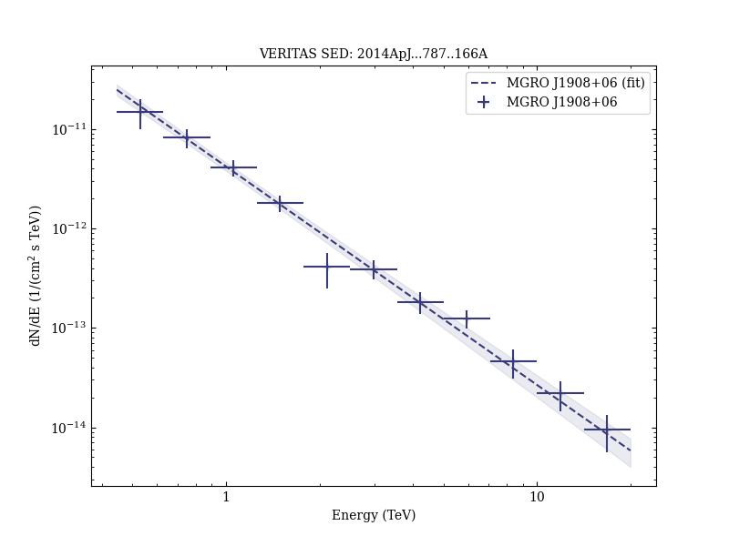

# Investigating the TeV Morphology of MGRO J1908+06 with VERITAS

Reference:
Aliu, E. et al. (The VERITAS Collaboration), The Astrophysical Journal, 787, 166 (2014)

- ADS: [2014ApJ...787..166A](http://adsabs.harvard.edu/abs/2014ApJ...787..166A)
- DOI: [10.1088/0004-637X/787/2/166](https://doi.org/10.1088/0004-637X/787/2/166)

## MGRO J1908+06 (VER J1907+062)
### Data files

- observation data: [VER-000132.yaml](VER-000132.yaml)
- spectral data: [VER-000132-sed.ecsv](VER-000132-sed.ecsv)
- observation data and fit results: [VER-000132.yaml](VER-000132.yaml)
- FITS data: [VER-000132-skymap.fits](VER-000132-skymap.fits)

### Figures

