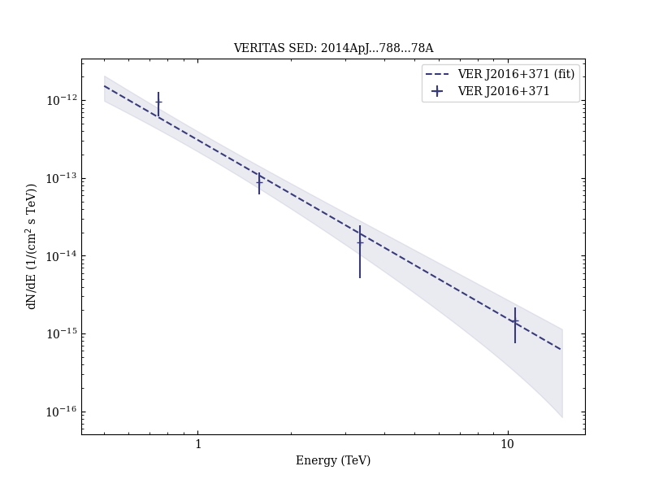
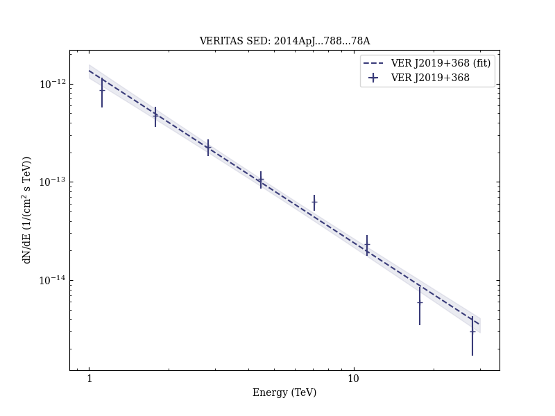

# Spatially Resolving the Very High Energy Emission from MGRO J2019+37 with VERITAS

Reference:
Aliu, E. et al. (The VERITAS Collaboration), The Astrophysical Journal, 788, 78 (2014)

- ADS: [2014ApJ...788...78A](http://adsabs.harvard.edu/abs/2014ApJ...788...78A)
- DOI: [10.1088/0004-637X/788/1/78](https://doi.org/10.1088/0004-637X/788/1/78)

## VER J2016+371
### Data files

- observation data: [VER-000141.yaml](VER-000141.yaml)
- spectral data: [VER-000141-sed.ecsv](VER-000141-sed.ecsv)
- observation data and fit results: [VER-000141.yaml](VER-000141.yaml)

### Figures

## VER J2019+368
### Data files

- observation data: [VER-000143.yaml](VER-000143.yaml)
- spectral data: [VER-000143-sed.ecsv](VER-000143-sed.ecsv)
- observation data and fit results: [VER-000143.yaml](VER-000143.yaml)

### Figures

