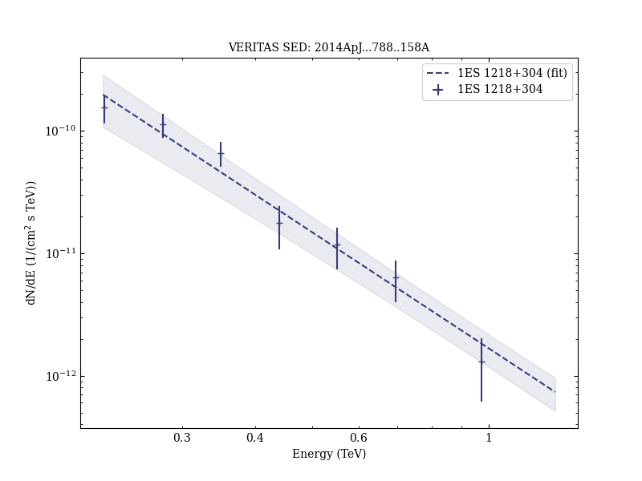

# Test of Models of the Cosmic Infrared Background with Multiwavelength Observations of the Blazar 1ES 1218+30.4 in 2009

Reference:
Archambault, S. et al. (The VERITAS Collaboration), The Astrophysical Journal, 788, 158 (2014)

- ADS: [2014ApJ...788..158A](http://adsabs.harvard.edu/abs/2014ApJ...788..158A)
- DOI: [10.1088/0004-637X/788/2/158](https://doi.org/10.1088/0004-637X/788/2/158)

## 1ES 1218+304 (VER J1221+301)
### Data files

- observation data: [VER-000055.yaml](VER-000055.yaml)
- spectral data: [VER-000055-sed-1.ecsv](VER-000055-sed-1.ecsv)
- light-curve data: [VER-000055-lc-1.ecsv](VER-000055-lc-1.ecsv)
- observation data and fit results: [VER-000055.yaml](VER-000055.yaml)

### Figures

