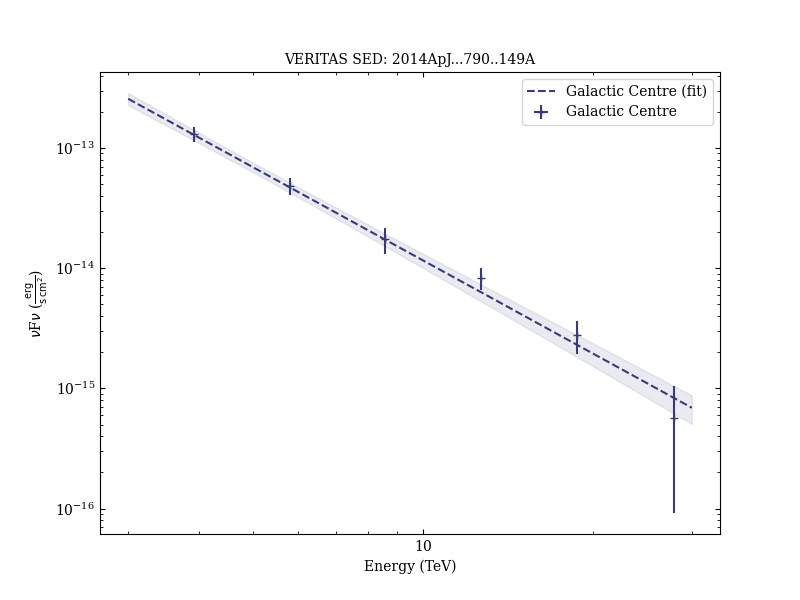

# Very-high Energy Observations of the Galactic Center Region by VERITAS in 2010-2012

Reference:
Archer, A. et al. (The VERITAS Collaboration), The Astrophysical Journal, 790, 149 (2014)

- ADS: [2014ApJ...790..149A](http://adsabs.harvard.edu/abs/2014ApJ...790..149A)
- DOI: [10.1088/0004-637X/790/2/149](https://doi.org/10.1088/0004-637X/790/2/149)

## Galactic Centre (VER J1745-290)
### Data files

- observation data: [VER-000106.yaml](VER-000106.yaml)
- spectral data: [VER-000106-sed.ecsv](VER-000106-sed.ecsv)
- light-curve data: [VER-000106-lc-1.ecsv](VER-000106-lc-1.ecsv)  [VER-000106-lc-2.ecsv](VER-000106-lc-2.ecsv)
- observation data and fit results: [VER-000106.yaml](VER-000106.yaml)

### Figures

