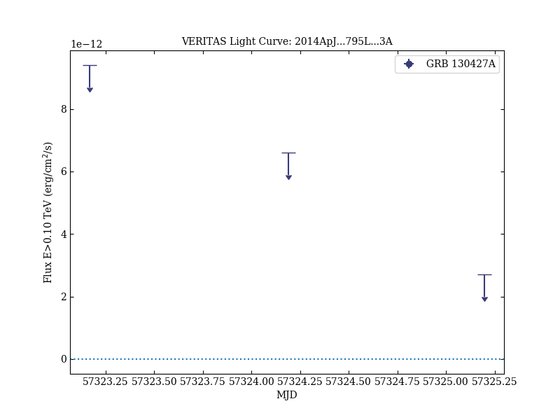

# Constraints on Very High Energy Emission from GRB 130427A

Reference:
Aliu, E. et al. (The VERITAS Collaboration), The Astrophysical Journal, 795, L3 (2014)

- ADS: [2014ApJ...795L...3A](http://adsabs.harvard.edu/abs/2014ApJ...795L...3A)
- DOI: [10.1088/2041-8205/795/1/L3](https://doi.org/10.1088/2041-8205/795/1/L3)

## GRB 130427A
### Data files

- observation data: [VER-100182-1.yaml](VER-100182-1.yaml)
- light-curve data: [VER-100182-lc-1.ecsv](VER-100182-lc-1.ecsv)
- observation data and fit results: [VER-100182-1.yaml](VER-100182-1.yaml)

### Figures

