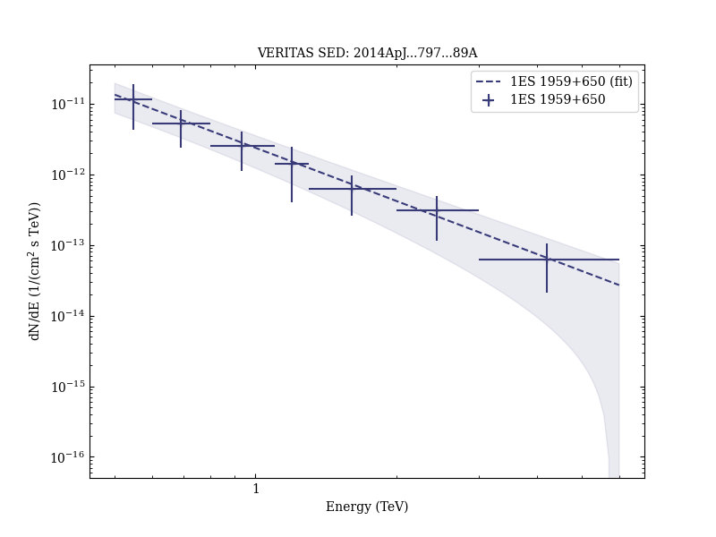
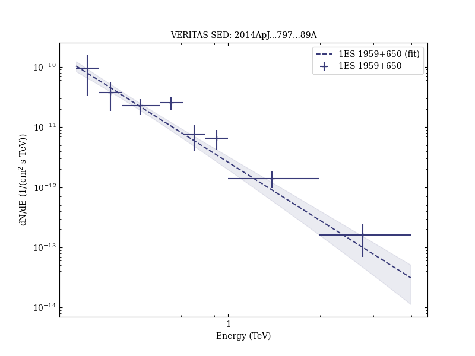
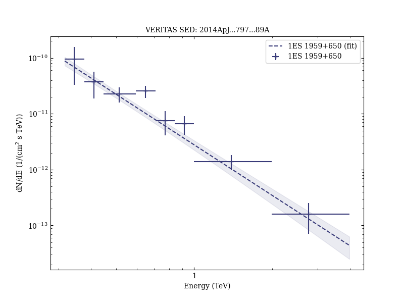

# Investigating Broadband Variability of the TeV Blazar 1ES 1959+650

Reference:
Aliu, E. et al. (The VERITAS Collaboration), The Astrophysical Journal, 797, 89 (2014)

- ADS: [2014ApJ...797...89A](http://adsabs.harvard.edu/abs/2014ApJ...797...89A)
- DOI: [10.1088/0004-637X/797/2/89](https://doi.org/10.1088/0004-637X/797/2/89)

## 1ES 1959+650 (VER J1959+651)
### Data files

- observation data: [VER-000138-1.yaml](VER-000138-1.yaml)  [VER-000138-2.yaml](VER-000138-2.yaml)  [VER-000138-3.yaml](VER-000138-3.yaml)  [VER-000138-4.yaml](VER-000138-4.yaml)  [VER-000138-5.yaml](VER-000138-5.yaml)
- spectral data: [VER-000138-sed-2.ecsv](VER-000138-sed-2.ecsv)  [VER-000138-sed-3.ecsv](VER-000138-sed-3.ecsv)  [VER-000138-sed-4.ecsv](VER-000138-sed-4.ecsv)  [VER-000138-sed-5.ecsv](VER-000138-sed-5.ecsv)
- light-curve data: [VER-000138-lc-1.ecsv](VER-000138-lc-1.ecsv)  [VER-000138-lc-2.ecsv](VER-000138-lc-2.ecsv)
- observation data and fit results: [VER-000138-1.yaml](VER-000138-1.yaml)  [VER-000138-2.yaml](VER-000138-2.yaml)  [VER-000138-3.yaml](VER-000138-3.yaml)  [VER-000138-4.yaml](VER-000138-4.yaml)  [VER-000138-5.yaml](VER-000138-5.yaml)

### Figures

