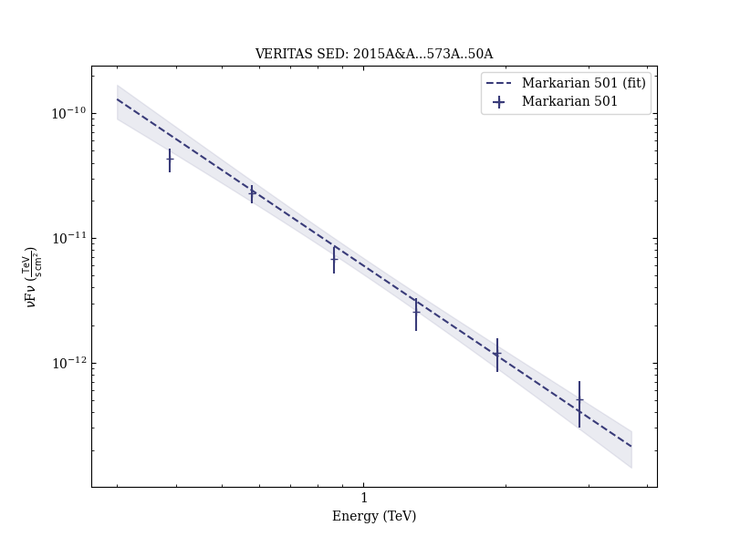
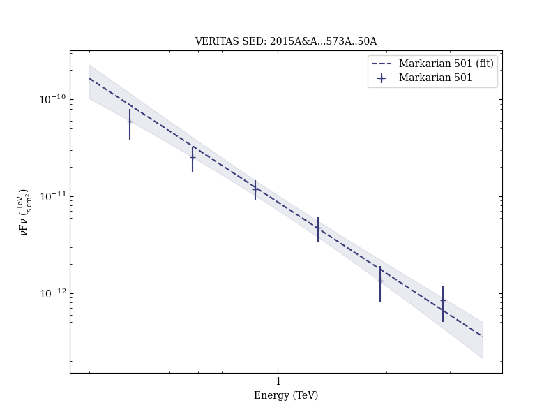
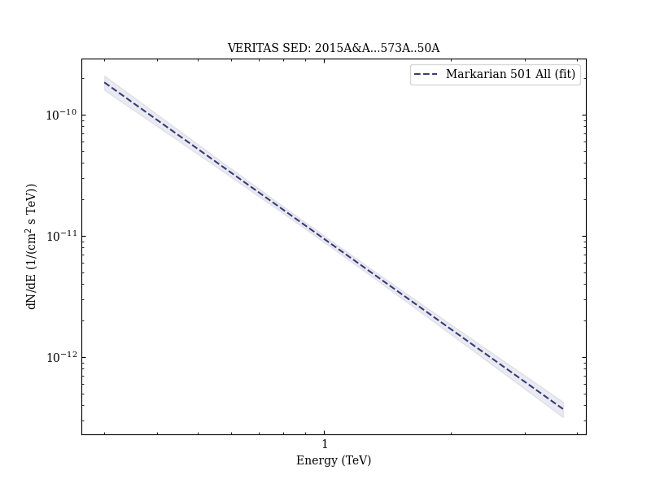

# Multiwavelength observations of Mrk 501 in 2008

Reference:
Aleksić, J. et al. (The MAGIC and VERITAS Collaborations), Astronomy & Astrophysics, 573, A50 (2015)

- ADS: [2015A&A...573A..50A](http://adsabs.harvard.edu/abs/2015A&A...573A..50A)
- DOI: [10.1051/0004-6361/201322906](https://doi.org/10.1051/0004-6361/201322906)

## Markarian 501 (VER J1653+397)
### Data files

- observation data: [VER-000091-2.yaml](VER-000091-2.yaml)  [VER-000091-3.yaml](VER-000091-3.yaml)  [VER-000091-4.yaml](VER-000091-4.yaml)  
- spectral data: [MAGIC-000091-sed-1.ecsv](MAGIC-000091-sed-1.ecsv)  [VER-000091-sed-2.ecsv](VER-000091-sed-2.ecsv)  [VER-000091-sed-3.ecsv](VER-000091-sed-3.ecsv)  
- light-curve data: [VER-000091-lc-2.ecsv](VER-000091-lc-2.ecsv)  
- observation data and fit results: [VER-000091-2.yaml](VER-000091-2.yaml)  [VER-000091-3.yaml](VER-000091-3.yaml)  [VER-000091-4.yaml](VER-000091-4.yaml)  

### Figures

