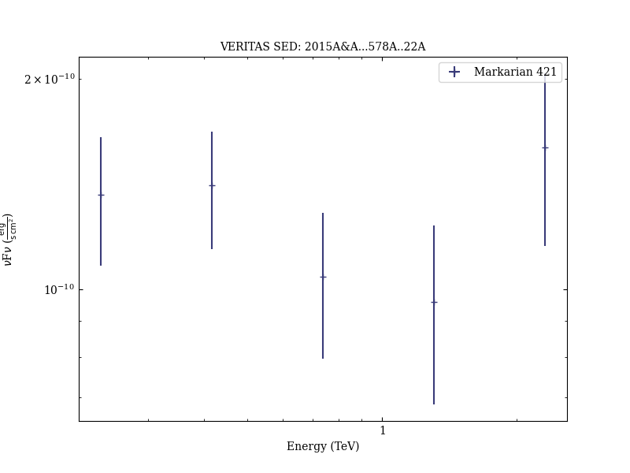
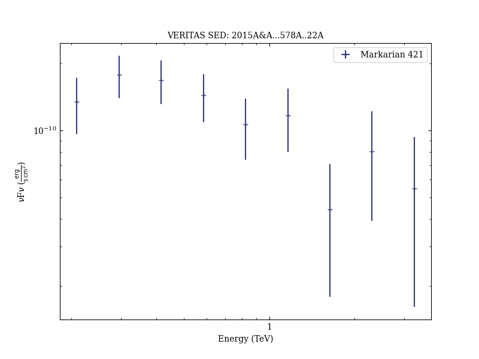
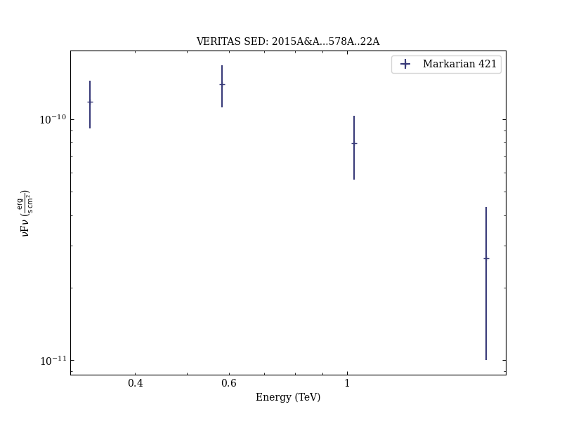
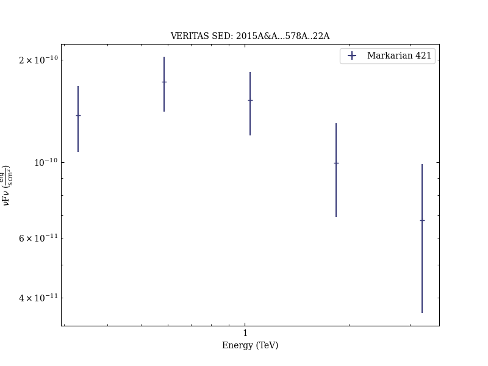
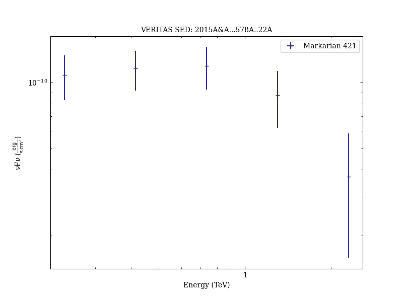

# Unprecedented study of the broadband emission of Mrk 421 during flaring activity in March 2010

Reference:
Aleksić, J. et al. (The VERITAS Collaboration), Astronomy & Astrophysics, 578, A22 (2015)

- ADS: [2015A&A...578A..22A](http://adsabs.harvard.edu/abs/2015A&A...578A..22A)
- DOI: [10.1051/0004-6361/201424811](https://doi.org/10.1051/0004-6361/201424811)

## Markarian 421 (VER J1104+382)
### Data files

- spectral data: [VER-000049-sed-1.ecsv](VER-000049-sed-1.ecsv)  [VER-000049-sed-2.ecsv](VER-000049-sed-2.ecsv)  [VER-000049-sed-3.ecsv](VER-000049-sed-3.ecsv)  [VER-000049-sed-4.ecsv](VER-000049-sed-4.ecsv)  [VER-000049-sed-5.ecsv](VER-000049-sed-5.ecsv)  [VER-000049-sed-6.ecsv](VER-000049-sed-6.ecsv)  [VER-000049-sed-7.ecsv](VER-000049-sed-7.ecsv)  [VER-000049-sed-8.ecsv](VER-000049-sed-8.ecsv)  [VER-000049-sed-9.ecsv](VER-000049-sed-9.ecsv)  
- light-curve data: [VER-000049-lc-1.ecsv](VER-000049-lc-1.ecsv)  

### Figures

