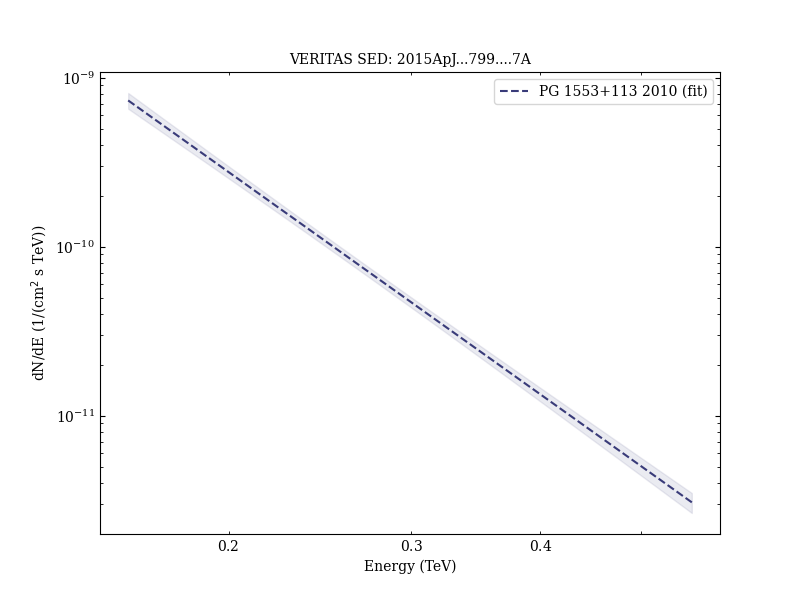
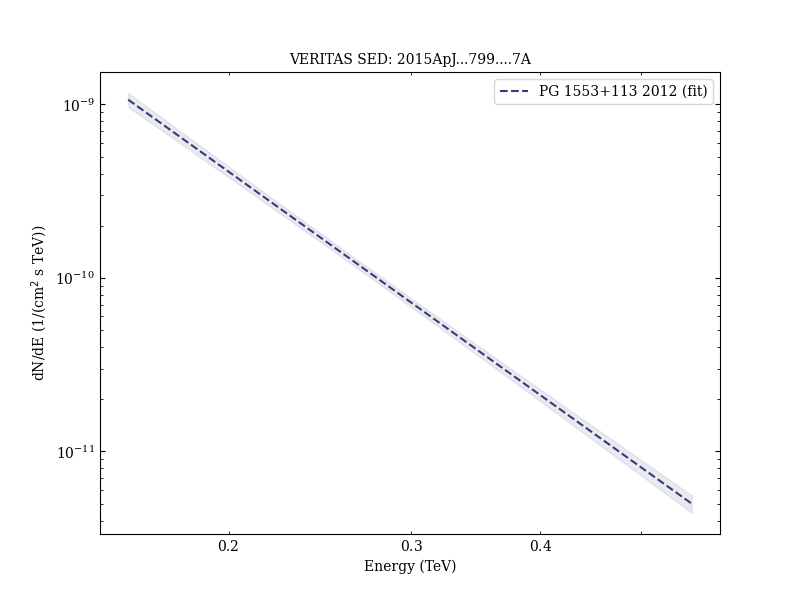

# VERITAS Observations of the BL Lac Object PG 1553+113

Reference:
Aliu, E. et al. (The VERITAS Collaboration), The Astrophysical Journal, 799, 7 (2015)

- ADS: [2015ApJ...799....7A](http://adsabs.harvard.edu/abs/2015ApJ...799....7A)
- DOI: [10.1088/0004-637X/799/1/7](https://doi.org/10.1088/0004-637X/799/1/7)

## PG 1553+113 (VER J1555+111)
### Data files

- observation data: [VER-000082-1.yaml](VER-000082-1.yaml)  [VER-000082-2.yaml](VER-000082-2.yaml)  [VER-000082-3.yaml](VER-000082-3.yaml)  [VER-000082-4.yaml](VER-000082-4.yaml)  
- spectral data: [VER-000082-sed-1.ecsv](VER-000082-sed-1.ecsv)  
- light-curve data: [VER-000082-lc-1.ecsv](VER-000082-lc-1.ecsv)  
- observation data and fit results: [VER-000082-1.yaml](VER-000082-1.yaml)  [VER-000082-2.yaml](VER-000082-2.yaml)  [VER-000082-3.yaml](VER-000082-3.yaml)  [VER-000082-4.yaml](VER-000082-4.yaml)  

### Figures

