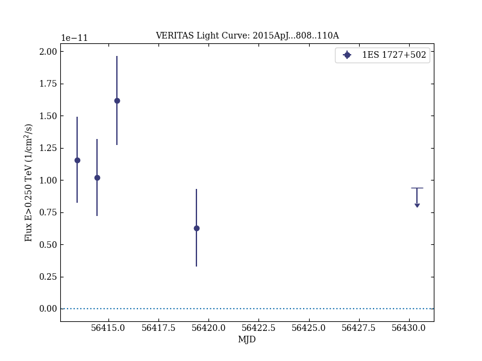

# VERITAS Detection of γ-Ray Flaring Activity From the BL Lac Object 1ES 1727+502 During Bright Moonlight Observations

Reference:
Archambault, S. et al. (The VERITAS Collaboration), The Astrophysical Journal, 808, 110 (2015)

- ADS: [2015ApJ...808..110A](http://adsabs.harvard.edu/abs/2015ApJ...808..110A)
- DOI: [10.1088/0004-637X/808/2/110](https://doi.org/10.1088/0004-637X/808/2/110)

## 1ES 1727+502 (VER J1728+502)
### Data files

- observation data: [VER-000101.yaml](VER-000101.yaml)  
- spectral data: [VER-000101-sed.ecsv](VER-000101-sed.ecsv)  
- light-curve data: [VER-000101-lc.ecsv](VER-000101-lc.ecsv)  
- observation data and fit results: [VER-000101.yaml](VER-000101.yaml)  

### Figures

