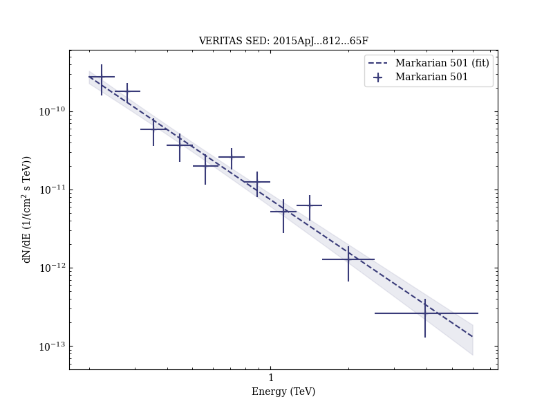
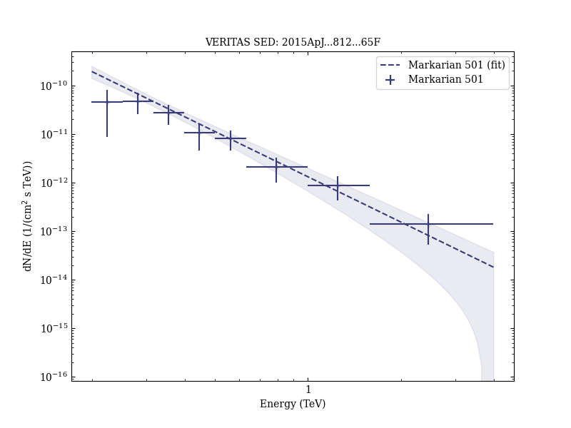

# First NuSTAR Observations of Mrk 501 within a Radio to TeV Multi-Instrument Campaign

Reference:
Furniss, A. et al. (The VERITAS and MAGIC Collaborations), The Astrophysical Journal, 812, 65 (2015)

- ADS: [2015ApJ...812...65F](http://adsabs.harvard.edu/abs/2015ApJ...812...65F)
- DOI: [10.1088/0004-637X/812/1/65](https://doi.org/10.1088/0004-637X/812/1/65)

## Markarian 501 (VER J1653+397)
### Data files

- observation data: [VER-000091-1.yaml](VER-000091-1.yaml)  [VER-000091-2.yaml](VER-000091-2.yaml)  
- spectral data: [VER-000091-sed-1.ecsv](VER-000091-sed-1.ecsv)  [VER-000091-sed-2.ecsv](VER-000091-sed-2.ecsv)  
- light-curve data: [VER-000091-lc.ecsv](VER-000091-lc.ecsv)  
- observation data and fit results: [VER-000091-1.yaml](VER-000091-1.yaml)  [VER-000091-2.yaml](VER-000091-2.yaml)  

### Figures

