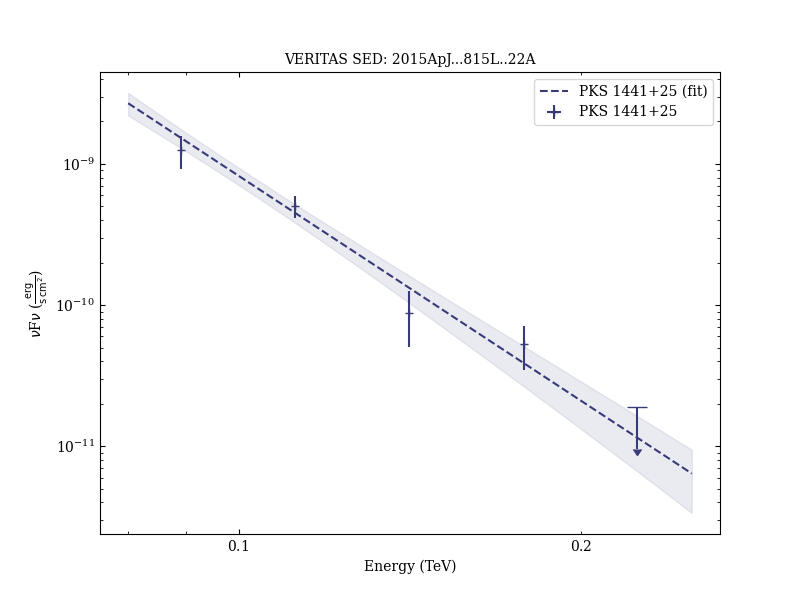

# Gamma-Rays from the Quasar PKS 1441+25: Story of an Escape

Reference:
Abeysekara, A. U. et al. (The VERITAS Collaboration), The Astrophysical Journal, 815, L22 (2015)

- ADS: [2015ApJ...815L..22A](http://adsabs.harvard.edu/abs/2015ApJ...815L..22A)
- DOI: [10.1088/2041-8205/815/2/L22](https://doi.org/10.1088/2041-8205/815/2/L22)

## PKS 1441+25 (VER J1443+250)
### Data files

- observation data: [VER-000167.yaml](VER-000167.yaml)
- spectral data: [VER-000167-sed.ecsv](VER-000167-sed.ecsv)
- light-curve data: [VER-000167-lc.ecsv](VER-000167-lc.ecsv)
- observation data and fit results: [VER-000167.yaml](VER-000167.yaml)

### Figures

