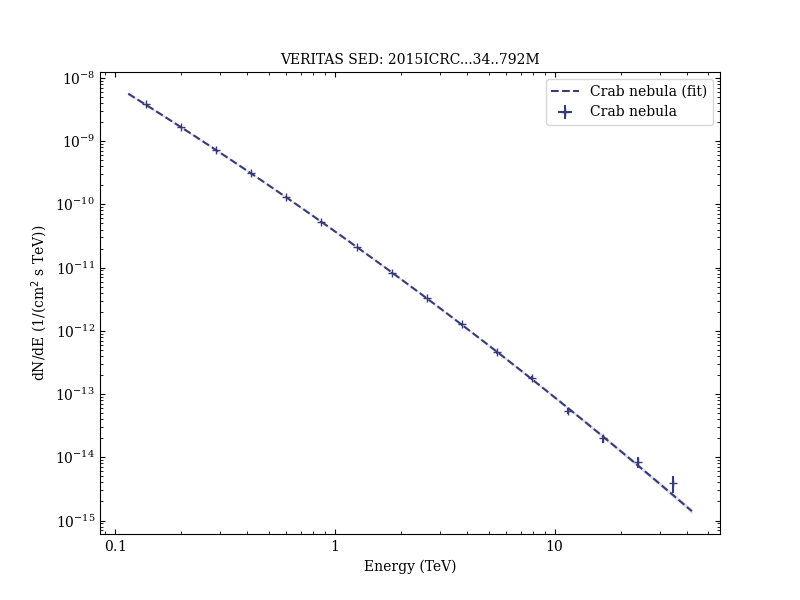

# Six years of VERITAS observations of the Crab Nebula

Reference:
Meagher, K. et al. (The VERITAS Collaboration), 34th International Cosmic Ray Conference. 30 July - 6 August, 2015. The Hague, The Netherlands, Proceedings of Science, 34, 792 (2015)

- ADS: [2015ICRC...34..792M](http://adsabs.harvard.edu/abs/2015ICRC...34..792M)
## Crab nebula
### Data files

- observation data: [VER-000025.yaml](VER-000025.yaml)  
- spectral data: [VER-000025-sed.ecsv](VER-000025-sed.ecsv)  
- observation data and fit results: [VER-000025.yaml](VER-000025.yaml)  

### Figures

