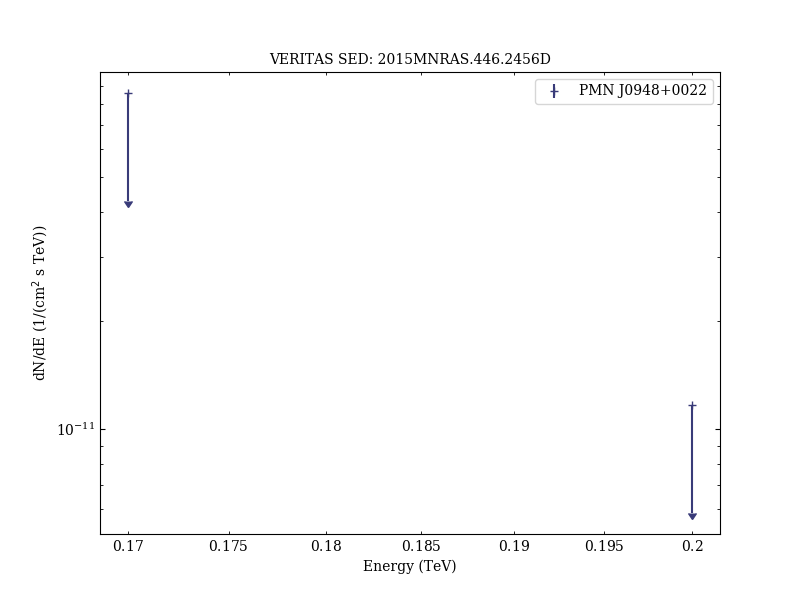
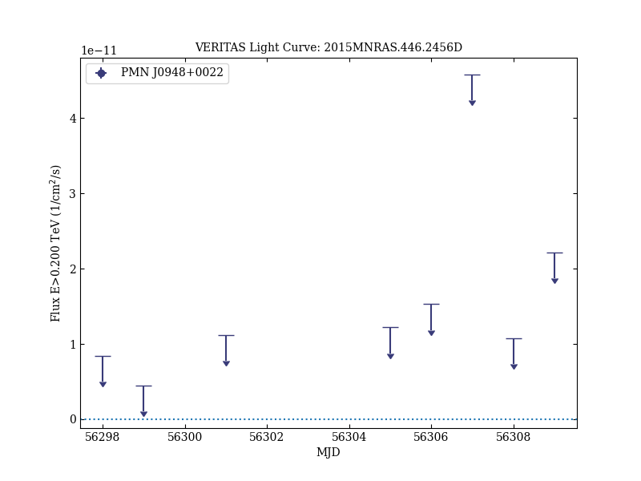
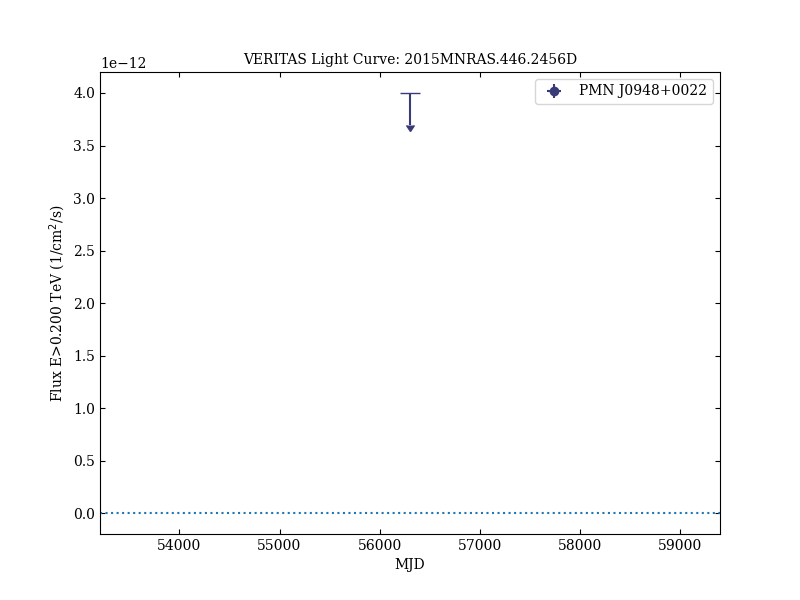

# The most powerful flaring activity from the NLSy1 PMN J0948+0022

Reference:
D'Ammando, F. et al. (The VERITAS Collaboration), Monthly Notices of the Royal Astronomical Society, 446, 2456 (2015)

- ADS: [2015MNRAS.446.2456D](http://adsabs.harvard.edu/abs/2015MNRAS.446.2456D)
- DOI: [10.1093/mnras/stu2251](https://doi.org/10.1093/mnras/stu2251)

## PMN J0948+0022
### Data files

- observation data: [VER-100181-1.yaml](VER-100181-1.yaml)  
- spectral data: [VER-100181-sed-1.ecsv](VER-100181-sed-1.ecsv)  
- light-curve data: [VER-100181-lc-1.ecsv](VER-100181-lc-1.ecsv)  [VER-100181-lc-2.ecsv](VER-100181-lc-2.ecsv)  
- observation data and fit results: [VER-100181-1.yaml](VER-100181-1.yaml)  

### Figures

