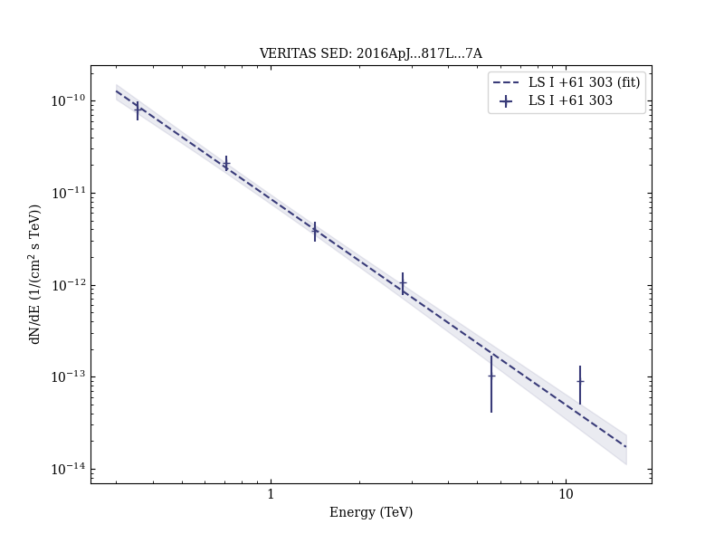

# Exceptionally Bright TeV Flares from the Binary LS I +61 303

Reference:
Archambault, S. et al. (The VERITAS Collaboration), The Astrophysical Journal, 817, L7 (2016)

- ADS: [2016ApJ...817L...7A](http://adsabs.harvard.edu/abs/2016ApJ...817L...7A)
- DOI: [10.3847/2041-8205/817/1/L7](https://doi.org/10.3847/2041-8205/817/1/L7)

## LS I +61 303 (VER J0240+612)
### Data files

- observation data: [VER-000014-1.yaml](VER-000014-1.yaml)  [VER-000014-2.yaml](VER-000014-2.yaml)  [VER-000014-3.yaml](VER-000014-3.yaml)  
- spectral data: [VER-000014-sed-1.ecsv](VER-000014-sed-1.ecsv)  [VER-000014-sed-2.ecsv](VER-000014-sed-2.ecsv)  [VER-000014-sed-3.ecsv](VER-000014-sed-3.ecsv)  
- light-curve data: [VER-000014-lc-1.ecsv](VER-000014-lc-1.ecsv)  
- observation data and fit results: [VER-000014-1.yaml](VER-000014-1.yaml)  [VER-000014-2.yaml](VER-000014-2.yaml)  [VER-000014-3.yaml](VER-000014-3.yaml)  

### Figures

