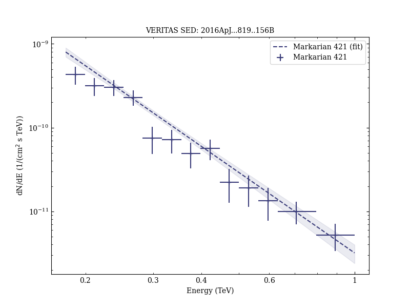
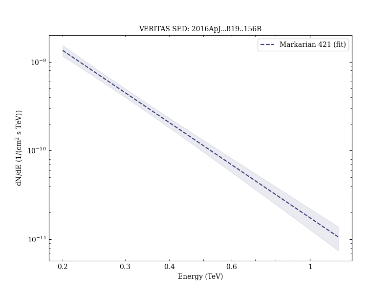

# Multiwavelength Study of Quiescent States of Mrk 421 with Unprecedented Hard X-Ray Coverage Provided by NuSTAR in 2013

Reference:
Baloković, M. et al. (The VERITAS and MAGIC Collaborations), The Astrophysical Journal, 819, 156 (2016)

- ADS: [2016ApJ...819..156B](http://adsabs.harvard.edu/abs/2016ApJ...819..156B)
- DOI: [10.3847/0004-637X/819/2/156](https://doi.org/10.3847/0004-637X/819/2/156)

## Markarian 421
### Data files

- observation data: [VER-000049-1.yaml](VER-000049-1.yaml)  [VER-000049-2.yaml](VER-000049-2.yaml)  [VER-000049-3.yaml](VER-000049-3.yaml)  [VER-000049-4.yaml](VER-000049-4.yaml)  [VER-000049-5.yaml](VER-000049-5.yaml)  [VER-000049-6.yaml](VER-000049-6.yaml)  [VER-000049-8.yaml](VER-000049-8.yaml)  [VER-000049-9.yaml](VER-000049-9.yaml)  [VER-000049-10.yaml](VER-000049-10.yaml)  [VER-000049-11.yaml](VER-000049-11.yaml)  
- spectral data: [VER-000049-sed-1.ecsv](VER-000049-sed-1.ecsv)  [VER-000049-sed-2.ecsv](VER-000049-sed-2.ecsv)  [VER-000049-sed-3.ecsv](VER-000049-sed-3.ecsv)  [VER-000049-sed-5.ecsv](VER-000049-sed-5.ecsv)  
- light-curve data: [VER-000049-lc-1.ecsv](VER-000049-lc-1.ecsv)  
- observation data and fit results: [VER-000049-1.yaml](VER-000049-1.yaml)  [VER-000049-2.yaml](VER-000049-2.yaml)  [VER-000049-3.yaml](VER-000049-3.yaml)  [VER-000049-4.yaml](VER-000049-4.yaml)  [VER-000049-5.yaml](VER-000049-5.yaml)  [VER-000049-6.yaml](VER-000049-6.yaml)  [VER-000049-8.yaml](VER-000049-8.yaml)  [VER-000049-9.yaml](VER-000049-9.yaml)  [VER-000049-10.yaml](VER-000049-10.yaml)  [VER-000049-11.yaml](VER-000049-11.yaml)  

### Figures

