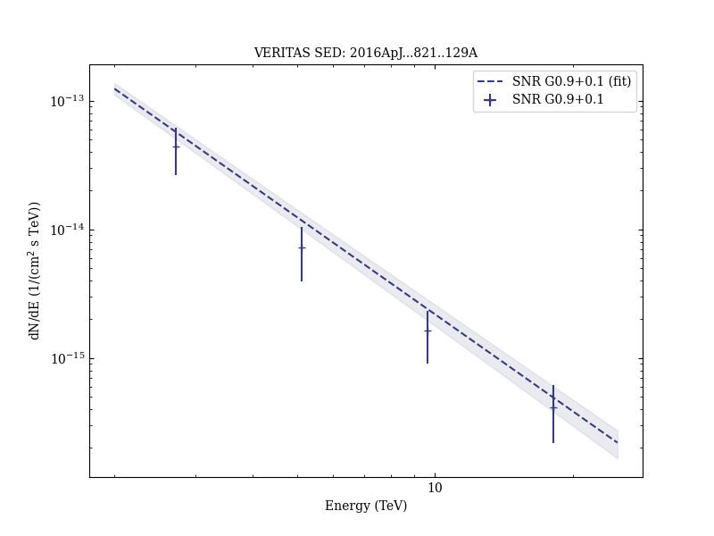

# TeV Gamma-Ray Observations of the Galactic Center Ridge by VERITAS

Reference:
Archer, A. et al. (The VERITAS Collaboration), The Astrophysical Journal, 821, 129 (2016)

- ADS: [2016ApJ...821..129A](http://adsabs.harvard.edu/abs/2016ApJ...821..129A)
- DOI: [10.3847/0004-637X/821/2/129](https://doi.org/10.3847/0004-637X/821/2/129)

## Galactic Centre (VER J1745-290)
### Data files

- observation data: [VER-000106.yaml](VER-000106.yaml)
- spectral data: [VER-000106-sed.ecsv](VER-000106-sed.ecsv)
- observation data and fit results: [VER-000106.yaml](VER-000106.yaml)

### Figures

## SNR G0.9+0.1 (VER J1747-281)
### Data files

- observation data: [VER-000110.yaml](VER-000110.yaml)
- spectral data: [VER-000110-sed.ecsv](VER-000110-sed.ecsv)
- observation data and fit results: [VER-000110.yaml](VER-000110.yaml)

### Figures

## VER J1746-289
### Data files

- observation data: [VER-000165.yaml](VER-000165.yaml)
- observation data and fit results: [VER-000165.yaml](VER-000165.yaml)
