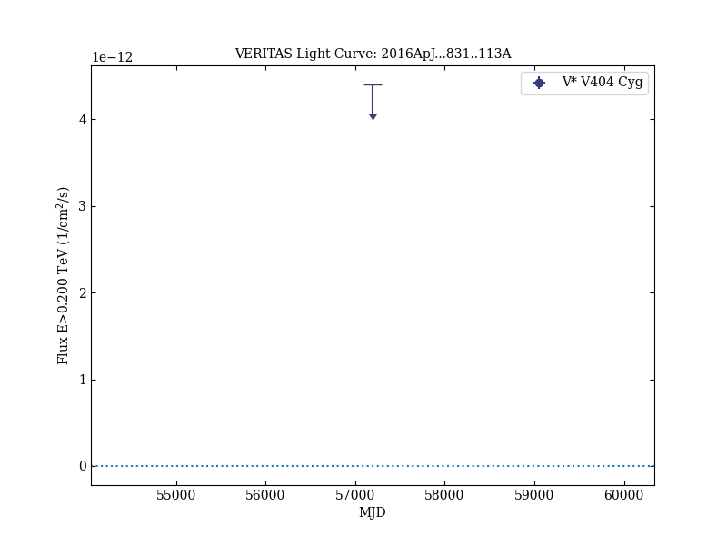
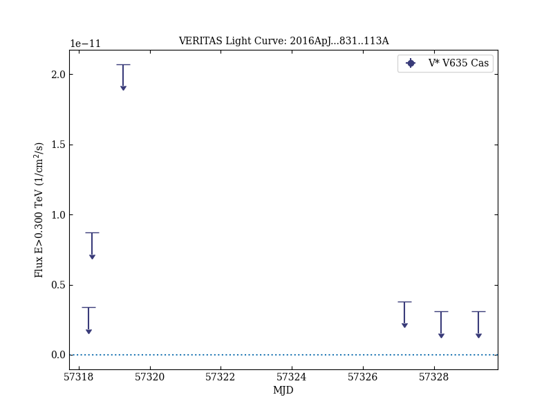

# Very High Energy Observations of the Binaries V 404 Cyg and 4U 0115+634 during Giant X-Ray Outbursts

Reference:
Archer, A. et al. (The VERITAS Collaboration), The Astrophysical Journal, 831, 113 (2016)

- ADS: [2016ApJ...831..113A](http://adsabs.harvard.edu/abs/2016ApJ...831..113A)
- DOI: [10.3847/0004-637X/831/1/113](https://doi.org/10.3847/0004-637X/831/1/113)

## V* V404 Cyg
### Data files

- observation data: [VER-100168.yaml](VER-100168.yaml)  
- light-curve data: [VER-100168-lc-1.ecsv](VER-100168-lc-1.ecsv)  [VER-100168-lc-2.ecsv](VER-100168-lc-2.ecsv)  
- observation data and fit results: [VER-100168.yaml](VER-100168.yaml)  

### Figures

## V* V635 Cas
### Data files

- observation data: [VER-100169.yaml](VER-100169.yaml)  
- light-curve data: [VER-100169-lc-1.ecsv](VER-100169-lc-1.ecsv)  [VER-100169-lc-2.ecsv](VER-100169-lc-2.ecsv)  
- observation data and fit results: [VER-100169.yaml](VER-100169.yaml)  

### Figures

