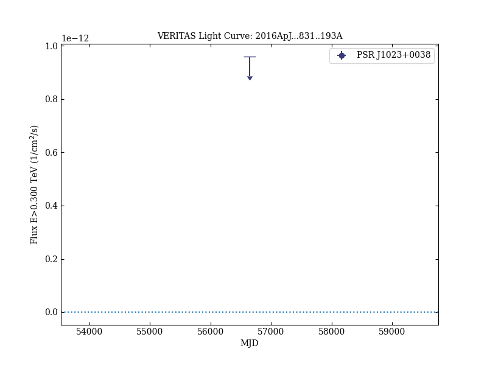
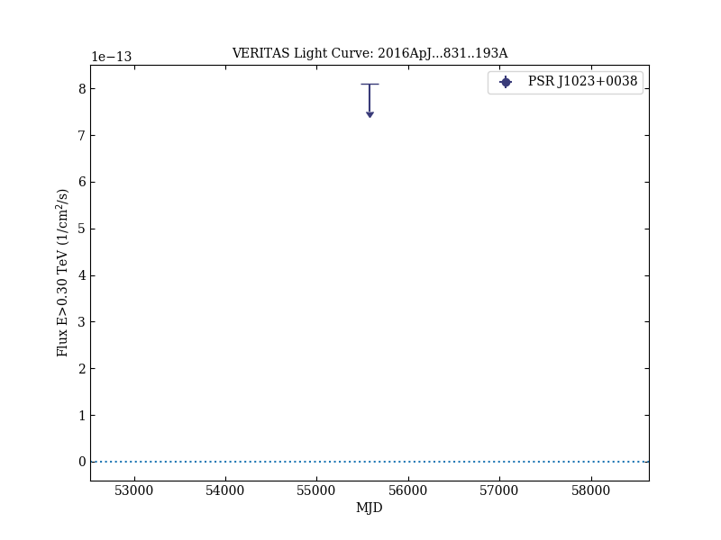

# A Search for Very High Energy Gamma Rays from the Missing Link Binary Pulsar J1023+0038 with VERITAS

Reference:
Aliu, E. et al. (The VERITAS Collaboration), The Astrophysical Journal, 831, 193 (2016)

- ADS: [2016ApJ...831..193A](http://adsabs.harvard.edu/abs/2016ApJ...831..193A)
- DOI: [10.3847/0004-637X/831/2/193](https://doi.org/10.3847/0004-637X/831/2/193)

## PSR J1023+0038
### Data files

- light-curve data: [VER-100178-lc-1.ecsv](VER-100178-lc-1.ecsv)  [VER-100178-lc-2.ecsv](VER-100178-lc-2.ecsv)  

### Figures

