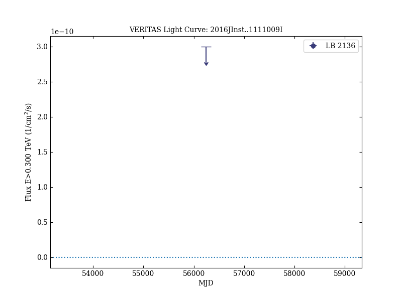

# Very high-energy gamma-ray follow-up program using neutrino triggers from IceCube

Reference:
IceCube Collaboration et al. (The VERITAS Collaboration), Journal of Instrumentation, 11, P11009 (2016)

- ADS: [2016JInst..1111009I](http://adsabs.harvard.edu/abs/2016JInst..1111009I)
- DOI: [10.1088/1748-0221/11/11/P11009](https://doi.org/10.1088/1748-0221/11/11/P11009)

## LB 2136
### Data files

- light-curve data: [VER-100179-lc-1.ecsv](VER-100179-lc-1.ecsv)

### Figures

