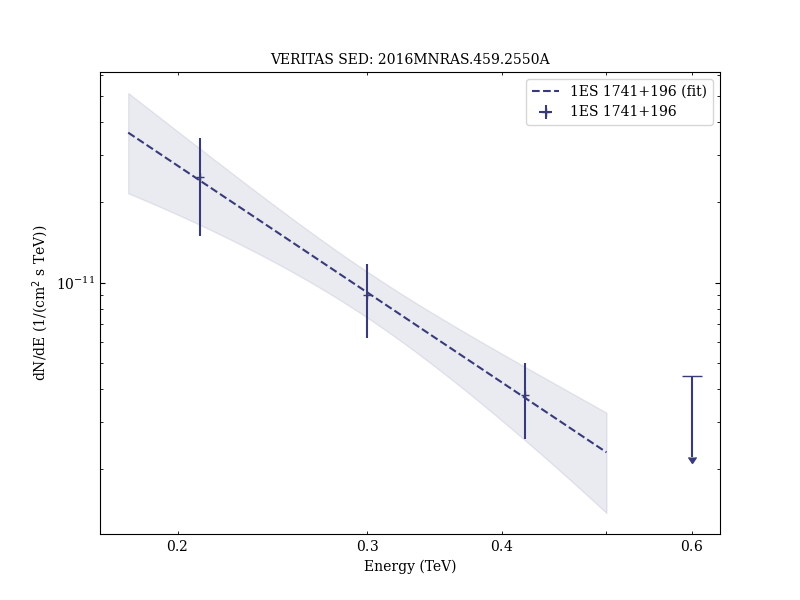
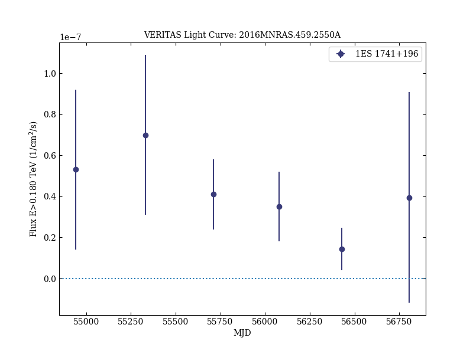

# VERITAS and multiwavelength observations of the BL Lacertae object 1ES 1741+196

Reference:
Abeysekara, A. U. et al. (The VERITAS Collaboration), Monthly Notices of the Royal Astronomical Society, 459, 2550 (2016)

- ADS: [2016MNRAS.459.2550A](http://adsabs.harvard.edu/abs/2016MNRAS.459.2550A)
- DOI: [10.1093/mnras/stw664](https://doi.org/10.1093/mnras/stw664)

## 1ES 1741+196 (VER J1744+195)
### Data files

- observation data: [VER-000105.yaml](VER-000105.yaml)
- spectral data: [VER-000105-sed.ecsv](VER-000105-sed.ecsv)
- light-curve data: [VER-000105-lc-1.ecsv](VER-000105-lc-1.ecsv)  [VER-000105-lc-2.ecsv](VER-000105-lc-2.ecsv)
- observation data and fit results: [VER-000105.yaml](VER-000105.yaml)

### Figures

