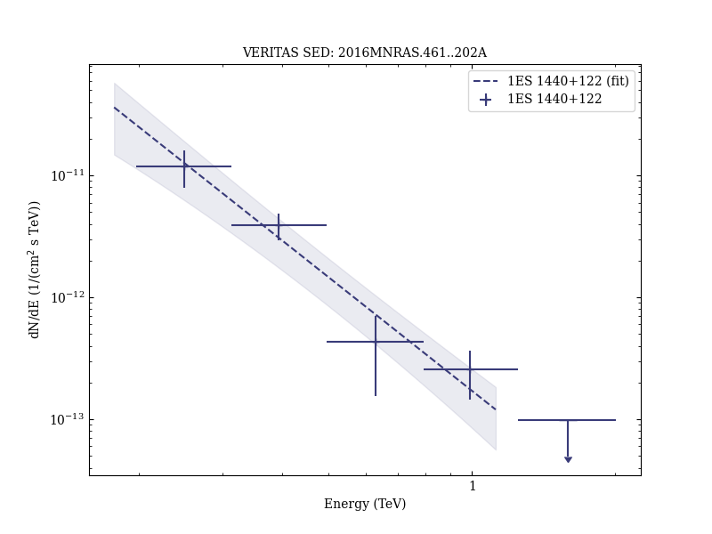

# Discovery of very high energy gamma rays from 1ES 1440+122

Reference:
Archambault, S. et al. (The VERITAS Collaboration), Monthly Notices of the Royal Astronomical Society, 461, 202 (2016)

- ADS: [2016MNRAS.461..202A](http://adsabs.harvard.edu/abs/2016MNRAS.461..202A)
- DOI: [10.1093/mnras/stw1319](https://doi.org/10.1093/mnras/stw1319)

## 1ES 1440+122 (VER J1443+120)
### Data files

- observation data: [VER-000071.yaml](VER-000071.yaml)
- spectral data: [VER-000071-sed.ecsv](VER-000071-sed.ecsv)
- observation data and fit results: [VER-000071.yaml](VER-000071.yaml)

### Figures

