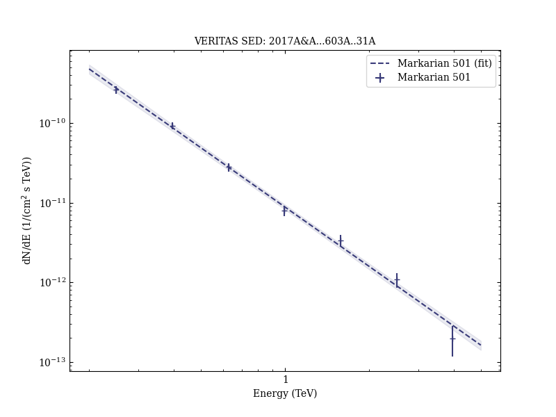

# Multiband variability studies and novel broadband SED modeling of Mrk 501 in 2009

Reference:
Ahnen, M. L. et al. (The MAGIC, WHIPPLE, and VERITAS Collaborations), Astronomy & Astrophysics, 603, A31 (2017)

- ADS: [2017A&A...603A..31A](http://adsabs.harvard.edu/abs/2017A&A...603A..31A)
- DOI: [10.1051/0004-6361/201629540](https://doi.org/10.1051/0004-6361/201629540)

## Markarian 501 (VER J1653+397)
### Data files

- observation data: [VER-000091-1.yaml](VER-000091-1.yaml)  [VER-000091-2.yaml](VER-000091-2.yaml)  
- spectral data: [VER-000091-sed-1.ecsv](VER-000091-sed-1.ecsv)  [VER-000091-sed-2.ecsv](VER-000091-sed-2.ecsv)  
- light-curve data: [VER-000091-lc.ecsv](VER-000091-lc.ecsv)  
- observation data and fit results: [VER-000091-1.yaml](VER-000091-1.yaml)  [VER-000091-2.yaml](VER-000091-2.yaml)  

### Figures

