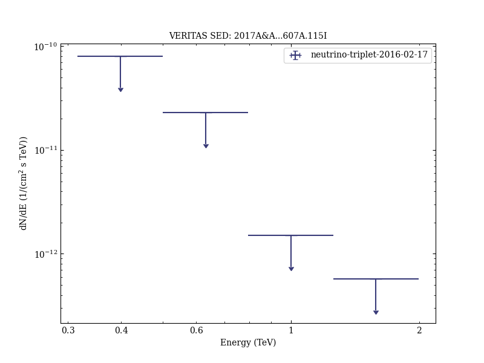

# Multiwavelength follow-up of a rare IceCube neutrino multiplet

Reference:
Icecube Collaboration et al. (The VERITAS Collaboration), Astronomy & Astrophysics, 607, A115 (2017)

- ADS: [2017A&A...607A.115I](http://adsabs.harvard.edu/abs/2017A&A...607A.115I)
- DOI: [10.1051/0004-6361/201730620](https://doi.org/10.1051/0004-6361/201730620)

## neutrino-triplet-2016-02-17 (VER-nodefined)
### Data files

- observation data: [VER-100202.yaml](VER-100202.yaml)  
- spectral data: [VER-100202-sed-1.ecsv](VER-100202-sed-1.ecsv)  
- observation data and fit results: [VER-100202.yaml](VER-100202.yaml)  

### Figures

