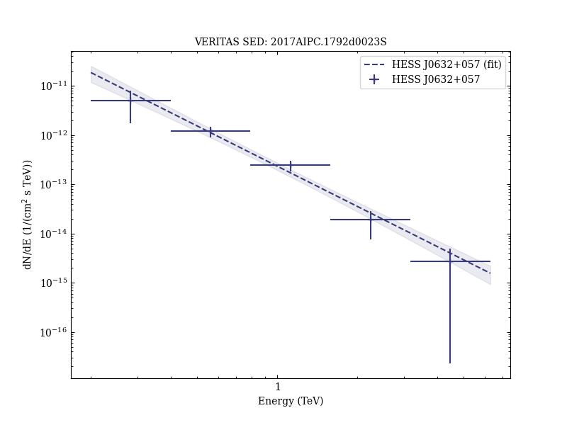
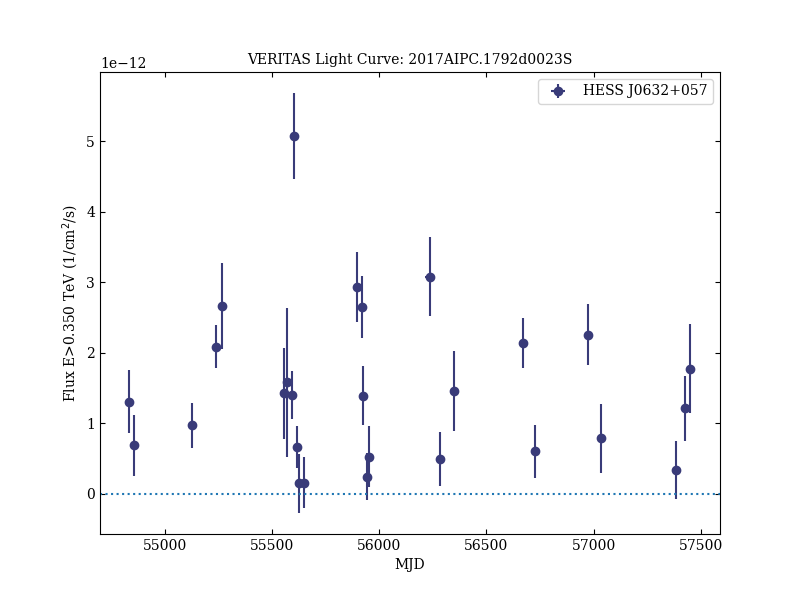
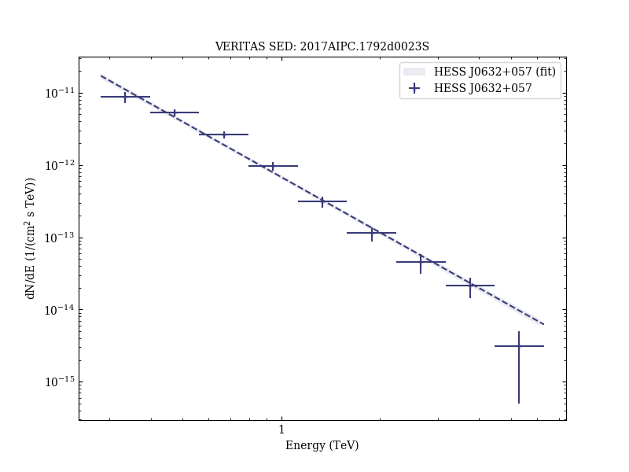

# A decade of TeV observations of the gamma-ray binary HESS J0632+057 with VERITAS

Reference:
Schlenstedt, S. et al. (The VERITAS Collaboration), AIP Conference Proceedings, 1792, 040023 (2017)

- ADS: [2017AIPC.1792d0023S](http://adsabs.harvard.edu/abs/2017AIPC.1792d0023S)
- DOI: [10.1063/1.4968927](https://doi.org/10.1063/1.4968927)

## HESS J0632+057 (VER J0633+057)
### Data files

- observation data: [VER-000030-1.yaml](VER-000030-1.yaml)  [VER-000030-2.yaml](VER-000030-2.yaml)  [VER-000030-3.yaml](VER-000030-3.yaml)  
- spectral data: [VER-000030-sed-1.ecsv](VER-000030-sed-1.ecsv)  [VER-000030-sed-2.ecsv](VER-000030-sed-2.ecsv)  [VER-000030-sed-3.ecsv](VER-000030-sed-3.ecsv)  
- light-curve data: [VER-000030-lc.ecsv](VER-000030-lc.ecsv)  
- observation data and fit results: [VER-000030-1.yaml](VER-000030-1.yaml)  [VER-000030-2.yaml](VER-000030-2.yaml)  [VER-000030-3.yaml](VER-000030-3.yaml)  

### Figures

