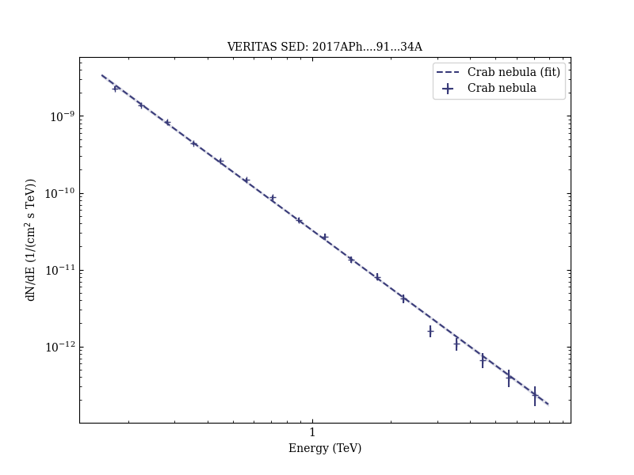
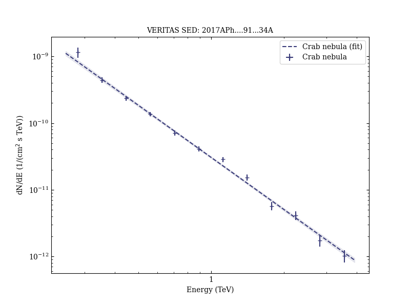
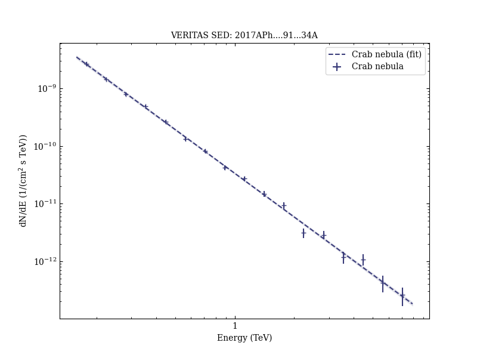

# Gamma-ray observations under bright moonlight with VERITAS

Reference:
Archambault, S. et al. (The VERITAS Collaboration), Astroparticle Physics, 91, 34 (2017)

- ADS: [2017APh....91...34A](http://adsabs.harvard.edu/abs/2017APh....91...34A)
- DOI: [10.1016/j.astropartphys.2017.03.001](https://doi.org/10.1016/j.astropartphys.2017.03.001)

## Crab nebula
### Data files

- observation data: [VER-000025-1.yaml](VER-000025-1.yaml)  [VER-000025-2.yaml](VER-000025-2.yaml)  [VER-000025-3.yaml](VER-000025-3.yaml)  
- spectral data: [VER-000025-sed-1.ecsv](VER-000025-sed-1.ecsv)  [VER-000025-sed-2.ecsv](VER-000025-sed-2.ecsv)  [VER-000025-sed-3.ecsv](VER-000025-sed-3.ecsv)  
- observation data and fit results: [VER-000025-1.yaml](VER-000025-1.yaml)  [VER-000025-2.yaml](VER-000025-2.yaml)  [VER-000025-3.yaml](VER-000025-3.yaml)  

### Figures

