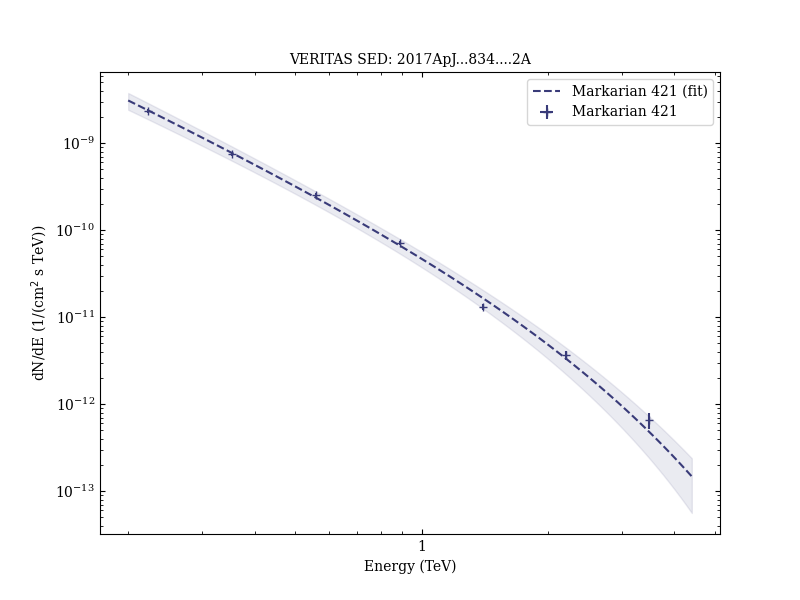
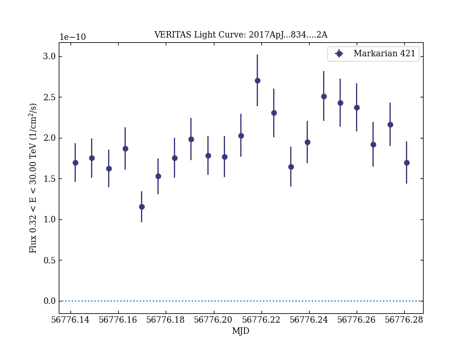

# A Search for Spectral Hysteresis and Energy-dependent Time Lags from X-Ray and TeV Gamma-Ray Observations of Mrk 421

Reference:
Abeysekara, A. U. et al. (The VERITAS Collaboration), The Astrophysical Journal, 834, 2 (2017)

- ADS: [2017ApJ...834....2A](http://adsabs.harvard.edu/abs/2017ApJ...834....2A)
- DOI: [10.3847/1538-4357/834/1/2](https://doi.org/10.3847/1538-4357/834/1/2)

## Markarian 421
### Data files

- observation data: [VER-000049-1.yaml](VER-000049-1.yaml)  [VER-000049-2.yaml](VER-000049-2.yaml)  
- spectral data: [VER-000049-sed-1.ecsv](VER-000049-sed-1.ecsv)  [VER-000049-sed-2.ecsv](VER-000049-sed-2.ecsv)  
- light-curve data: [VER-000049-lc-1.ecsv](VER-000049-lc-1.ecsv)  [VER-000049-lc-2.ecsv](VER-000049-lc-2.ecsv)  [VER-000049-lc-3.ecsv](VER-000049-lc-3.ecsv)  [VER-000049-lc-4.ecsv](VER-000049-lc-4.ecsv)  
- observation data and fit results: [VER-000049-1.yaml](VER-000049-1.yaml)  [VER-000049-2.yaml](VER-000049-2.yaml)  

### Figures

