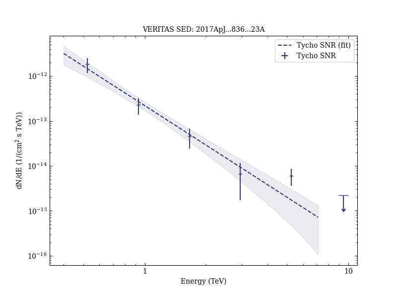

# Gamma-Ray Observations of Tycho’s Supernova Remnant with VERITAS and Fermi

Reference:
Archambault, S. et al. (The VERITAS Collaboration), The Astrophysical Journal, 836, 23 (2017)

- ADS: [2017ApJ...836...23A](http://adsabs.harvard.edu/abs/2017ApJ...836...23A)
- DOI: [10.3847/1538-4357/836/1/23](https://doi.org/10.3847/1538-4357/836/1/23)

## Tycho SNR (VER J0025+641)
### Data files

- observation data: [VER-000003.yaml](VER-000003.yaml)  
- spectral data: [VER-000003-sed.ecsv](VER-000003-sed.ecsv)  
- observation data and fit results: [VER-000003.yaml](VER-000003.yaml)  
- FITS data: [VER-000003-excess-skymap.fits](VER-000003-excess-skymap.fits)  

### Figures

