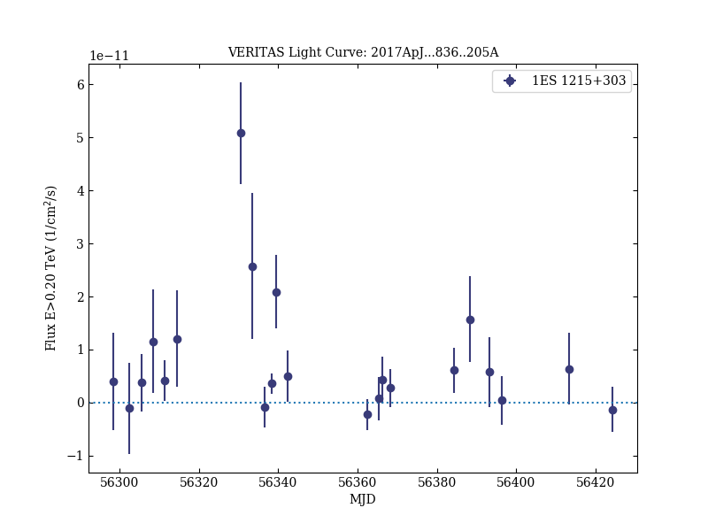
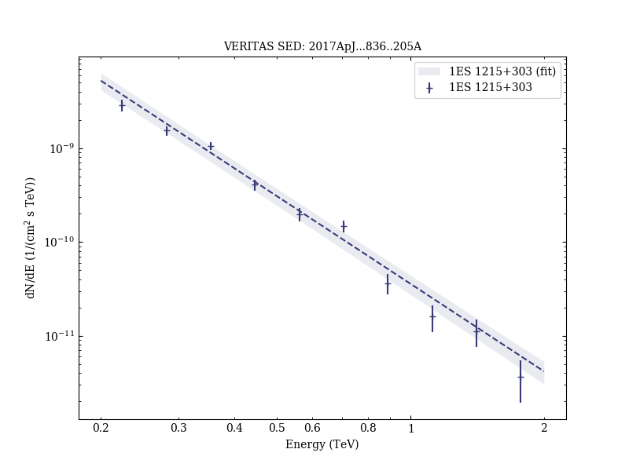
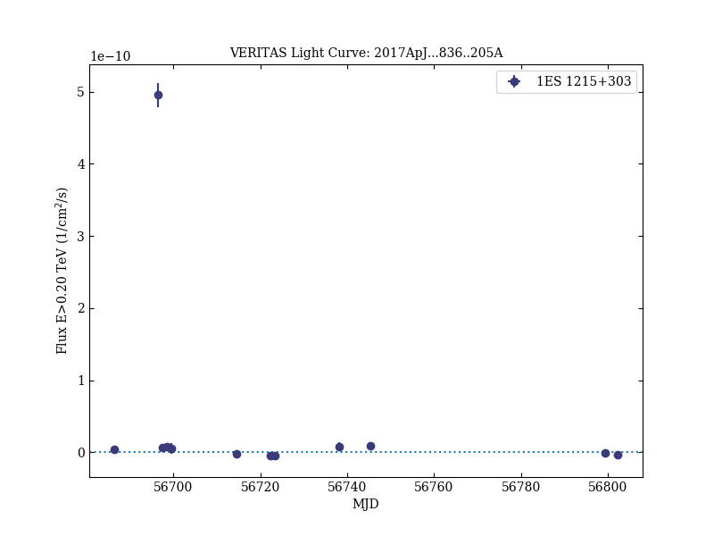
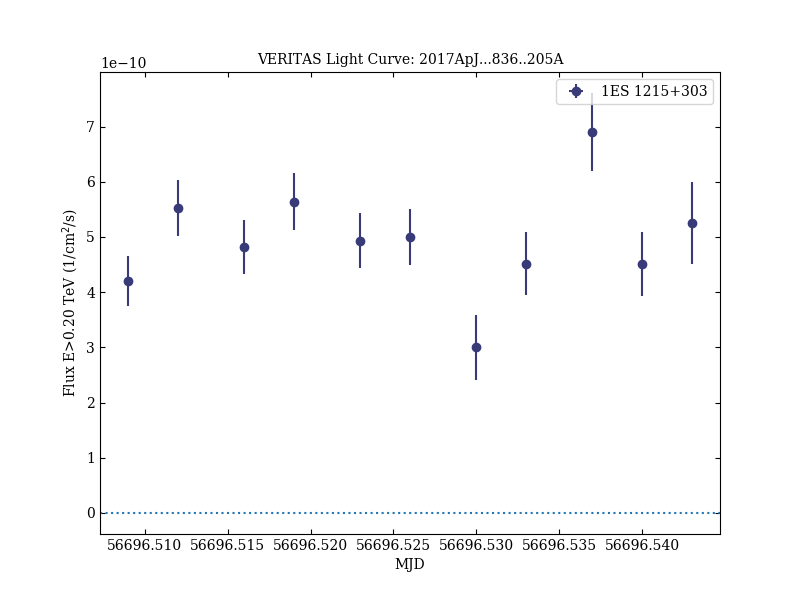

# A Luminous and Isolated Gamma-ray Flare from the Blazar B2 1215+30

Reference:
Abeysekara, A. U. et al. (The VERITAS Collaboration), The Astrophysical Journal, 836, 205 (2017)

- ADS: [2017ApJ...836..205A](http://adsabs.harvard.edu/abs/2017ApJ...836..205A)
- DOI: [10.3847/1538-4357/836/2/205](https://doi.org/10.3847/1538-4357/836/2/205)

## 1ES 1215+303 (VER J1217+301)
### Data files

- observation data: [VER-000053-1.yaml](VER-000053-1.yaml)  [VER-000053-2.yaml](VER-000053-2.yaml)
- spectral data: [VER-000053-sed.ecsv](VER-000053-sed.ecsv)
- light-curve data: [VER-000053-lc-1.ecsv](VER-000053-lc-1.ecsv)  [VER-000053-lc-2.ecsv](VER-000053-lc-2.ecsv)  [VER-000053-lc-3.ecsv](VER-000053-lc-3.ecsv)
- observation data and fit results: [VER-000053-1.yaml](VER-000053-1.yaml)  [VER-000053-2.yaml](VER-000053-2.yaml)

### Figures

