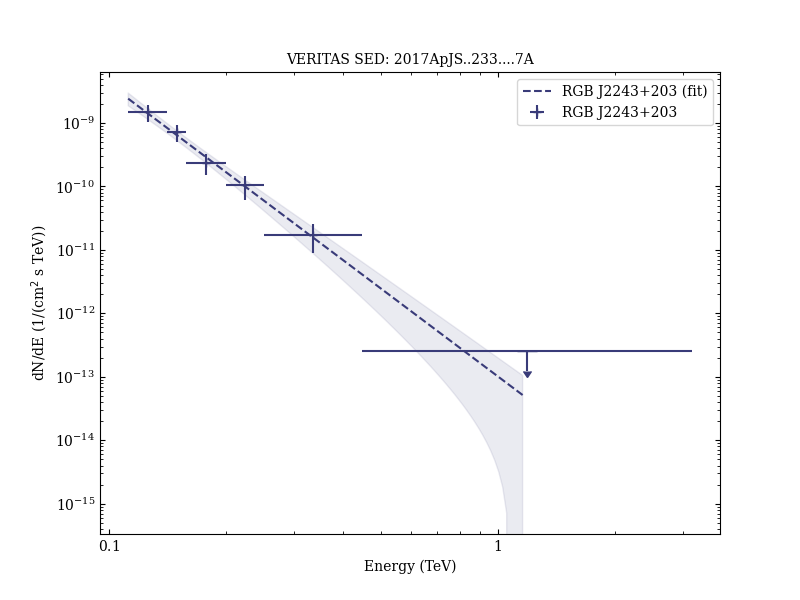

# Discovery of Very-high-energy Emission from RGB J2243+203 and Derivation of Its Redshift Upper Limit

Reference:
Abeysekara, A. U. et al. (The VERITAS Collaboration), The Astrophysical Journal, 233, 7 (2017)

- ADS: [2017ApJS..233....7A](http://adsabs.harvard.edu/abs/2017ApJS..233....7A)
- DOI: [10.3847/1538-4365/aa8d76](https://doi.org/10.3847/1538-4365/aa8d76)

## RGB J2243+203 (VER J2243+203)
### Data files

- observation data: [VER-000176.yaml](VER-000176.yaml)  
- spectral data: [VER-000176-sed-1.ecsv](VER-000176-sed-1.ecsv)  
- light-curve data: [VER-000176-lc-1.ecsv](VER-000176-lc-1.ecsv)  
- observation data and fit results: [VER-000176.yaml](VER-000176.yaml)  

### Figures

