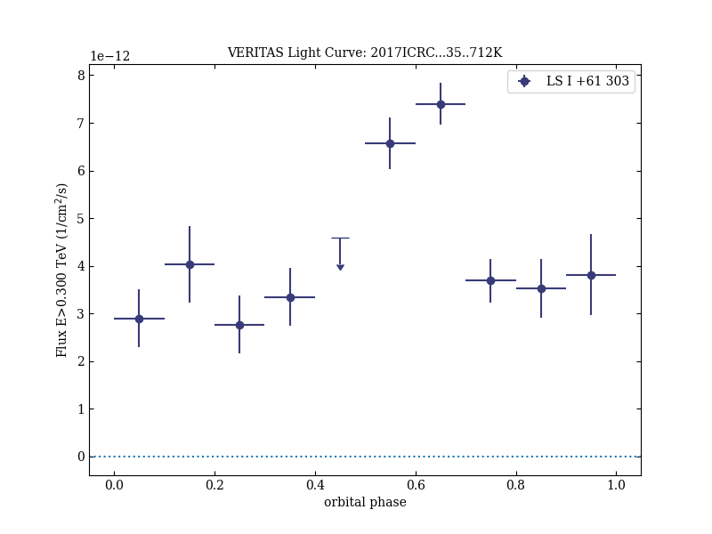

# Decadal VERITAS Observation of LS I +61°303: Detection of TeV emission around the entire orbit

Reference:
Kar, Payel et al. (The VERITAS Collaboration), 35th International Cosmic Ray Conference. 10-20 July, 2017. Bexco, Busan, Korea, Proceedings of Science, 301, 712 (2017)

- ADS: [2017ICRC...35..712K](http://adsabs.harvard.edu/abs/2017ICRC...35..712K)
- DOI: [10.22323/1.301.0712](https://doi.org/10.22323/1.301.0712)

## LS I +61 303 (VER J0240+612)
### Data files

- observation data: [VER-000014-1.yaml](VER-000014-1.yaml)  [VER-000014-2.yaml](VER-000014-2.yaml)
- light-curve data: [VER-000014-1-lc.ecsv](VER-000014-1-lc.ecsv)
- observation data and fit results: [VER-000014-1.yaml](VER-000014-1.yaml)  [VER-000014-2.yaml](VER-000014-2.yaml)

### Figures

