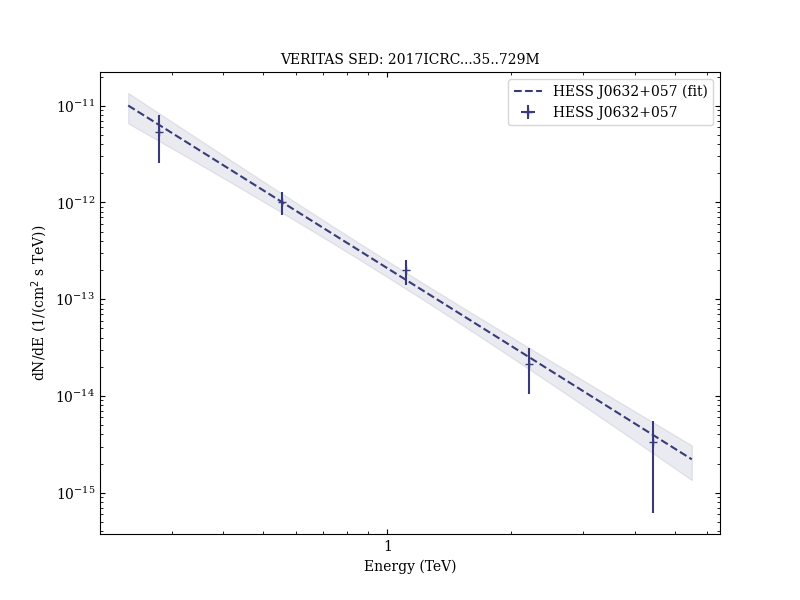
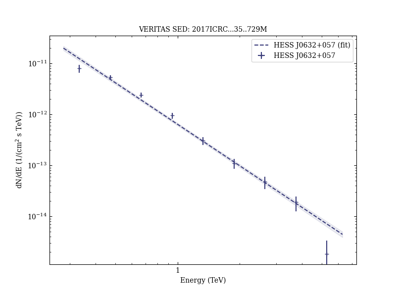
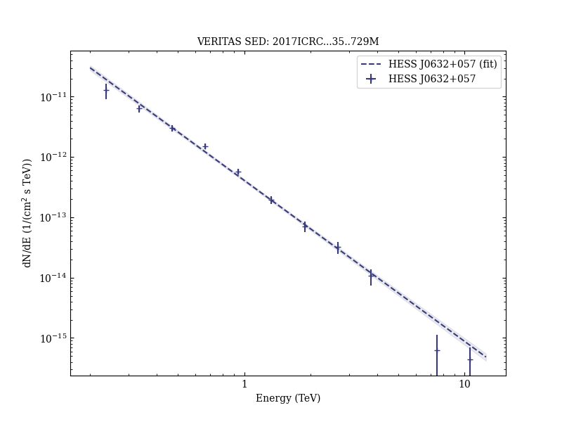

# VHE Observations of Galactic binary systems with VERITAS

Reference:
Maier, G. et al. (The VERITAS Collaboration), 35th International Cosmic Ray Conference. 10-20 July, 2017. Bexco, Busan, Korea, Proceedings of Science, 301, 729 (2017)

- ADS: [2017ICRC...35..729M](http://adsabs.harvard.edu/abs/2017ICRC...35..729M)
## HESS J0632+057 (VER J0633+057)
### Data files

- observation data: [VER-000030-1.yaml](VER-000030-1.yaml)  [VER-000030-2.yaml](VER-000030-2.yaml)  [VER-000030-3.yaml](VER-000030-3.yaml)  [VER-000030-4.yaml](VER-000030-4.yaml)  [VER-000030-5.yaml](VER-000030-5.yaml)  
- spectral data: [VER-000030-sed-1.ecsv](VER-000030-sed-1.ecsv)  [VER-000030-sed-2.ecsv](VER-000030-sed-2.ecsv)  [VER-000030-sed-4.ecsv](VER-000030-sed-4.ecsv)  [VER-000030-sed-5.ecsv](VER-000030-sed-5.ecsv)  
- light-curve data: [VER-000030-lc.ecsv](VER-000030-lc.ecsv)  
- observation data and fit results: [VER-000030-1.yaml](VER-000030-1.yaml)  [VER-000030-2.yaml](VER-000030-2.yaml)  [VER-000030-3.yaml](VER-000030-3.yaml)  [VER-000030-4.yaml](VER-000030-4.yaml)  [VER-000030-5.yaml](VER-000030-5.yaml)  

### Figures

