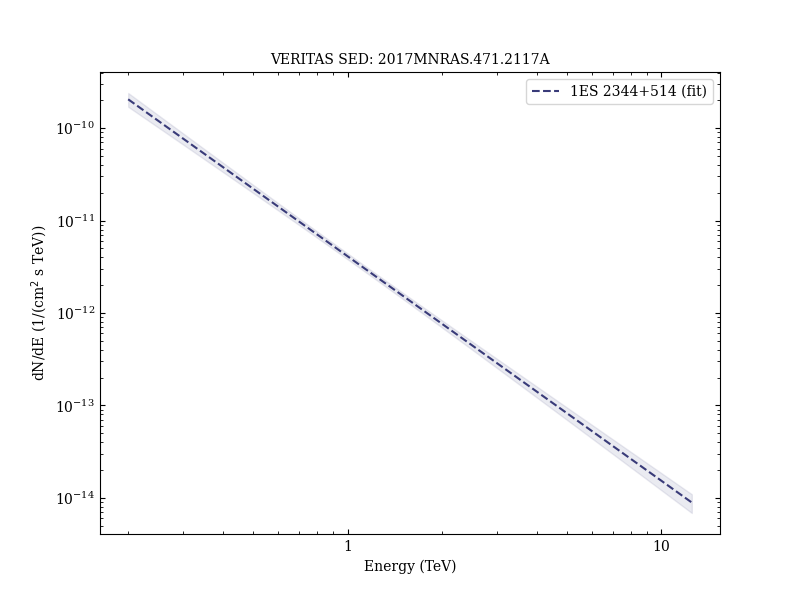
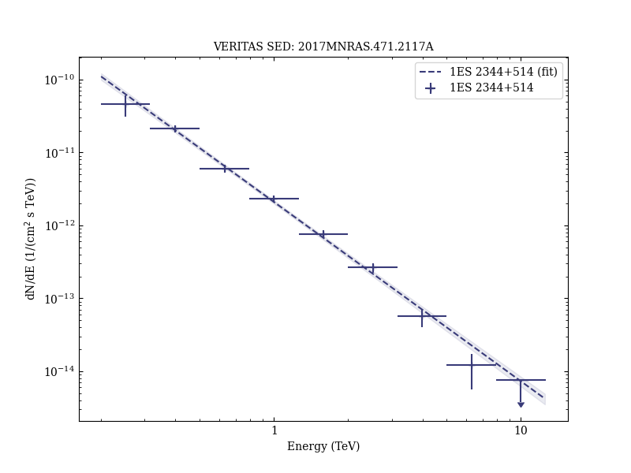

# Very-High-Energy γ-Ray Observations of the Blazar 1ES 2344+514 with VERITAS

Reference:
Allen, C. et al. (The VERITAS Collaboration), Monthly Notices of the Royal Astronomical Society, 471, 2117 (2017)

- ADS: [2017MNRAS.471.2117A](http://adsabs.harvard.edu/abs/2017MNRAS.471.2117A)
- DOI: [10.1093/mnras/stx1756](https://doi.org/10.1093/mnras/stx1756)

## 1ES 2344+514 (VER J2347+517)
### Data files

- observation data: [VER-000154-1.yaml](VER-000154-1.yaml)  [VER-000154-2.yaml](VER-000154-2.yaml)  [VER-000154-3.yaml](VER-000154-3.yaml)  
- spectral data: [VER-000154-sed-3.ecsv](VER-000154-sed-3.ecsv)  
- light-curve data: [VER-000154-lc-1.ecsv](VER-000154-lc-1.ecsv)  [VER-000154-lc-2.ecsv](VER-000154-lc-2.ecsv)  
- observation data and fit results: [VER-000154-1.yaml](VER-000154-1.yaml)  [VER-000154-2.yaml](VER-000154-2.yaml)  [VER-000154-3.yaml](VER-000154-3.yaml)  

### Figures

