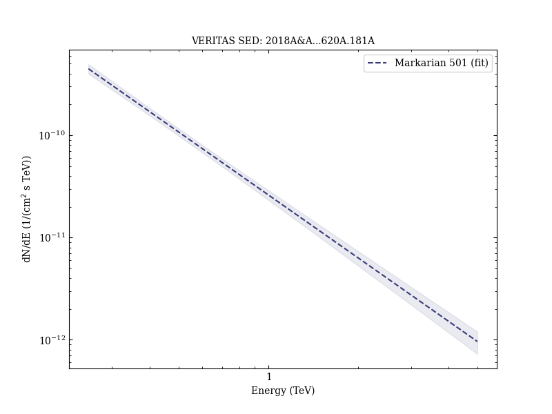
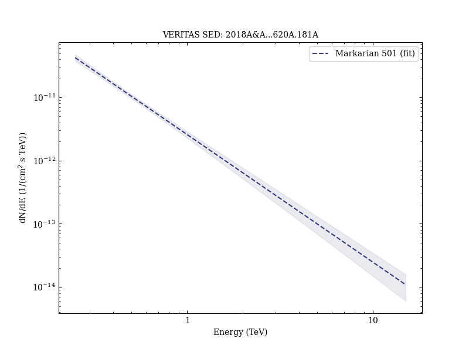
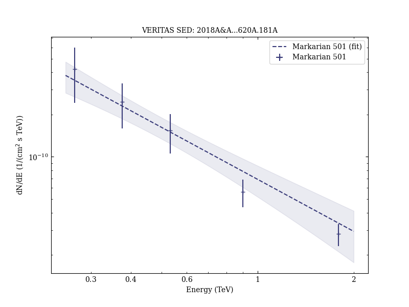
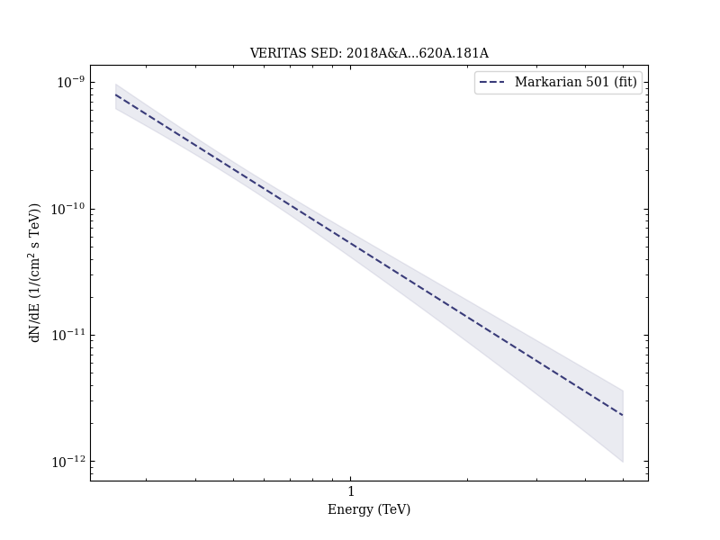
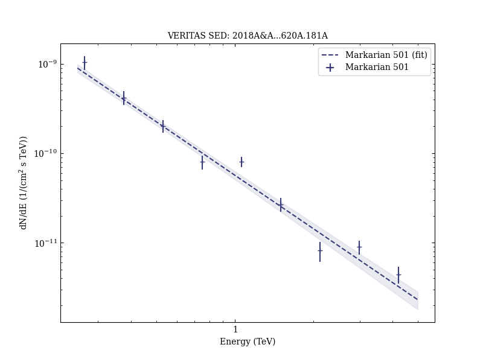
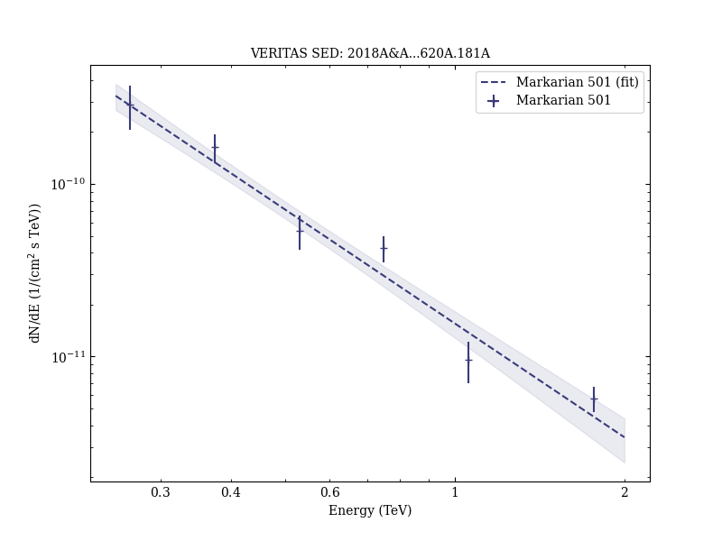
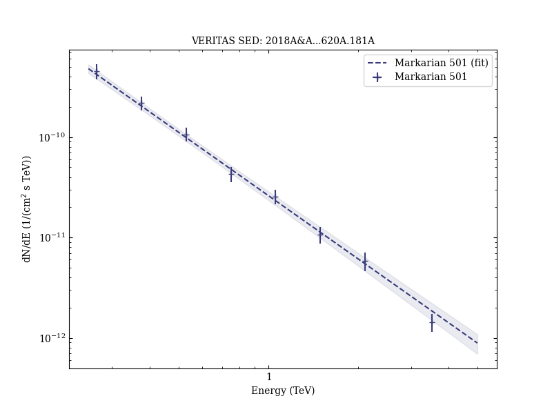

# Extreme HBL behavior of Markarian 501 during 2012

Reference:
Ahnen, M. L. et al., Astronomy & Astrophysics, 620, A181 (2018)

- ADS: [2018A&A...620A.181A](http://adsabs.harvard.edu/abs/2018A&A...620A.181A)
- DOI: [10.1051/0004-6361/201833704](https://doi.org/10.1051/0004-6361/201833704)

## Markarian 501 (VER J1653+397)
### Data files

- observation data: [VER-000091-1.yaml](VER-000091-1.yaml)  [VER-000091-2.yaml](VER-000091-2.yaml)  [VER-000091-3.yaml](VER-000091-3.yaml)  [VER-000091-4.yaml](VER-000091-4.yaml)  [VER-000091-5.yaml](VER-000091-5.yaml)  [VER-000091-6.yaml](VER-000091-6.yaml)  [VER-000091-7.yaml](VER-000091-7.yaml)  [VER-000091-8.yaml](VER-000091-8.yaml)  [VER-000091-9.yaml](VER-000091-9.yaml)  [VER-000091-10.yaml](VER-000091-10.yaml)  [VER-000091-11.yaml](VER-000091-11.yaml)  [VER-000091-12.yaml](VER-000091-12.yaml)  [VER-000091-13.yaml](VER-000091-13.yaml)  [VER-000091-14.yaml](VER-000091-14.yaml)  [VER-000091-15.yaml](VER-000091-15.yaml)  [VER-000091-16.yaml](VER-000091-16.yaml)  [VER-000091-17.yaml](VER-000091-17.yaml)  [VER-000091-18.yaml](VER-000091-18.yaml)  [VER-000091-19.yaml](VER-000091-19.yaml)  [VER-000091-20.yaml](VER-000091-20.yaml)  [VER-000091-21.yaml](VER-000091-21.yaml)  [VER-000091-22.yaml](VER-000091-22.yaml)
- spectral data: [VER-000091-sed-2.ecsv](VER-000091-sed-2.ecsv)  [VER-000091-sed-3.ecsv](VER-000091-sed-3.ecsv)  [VER-000091-sed-4.ecsv](VER-000091-sed-4.ecsv)  [VER-000091-sed-5.ecsv](VER-000091-sed-5.ecsv)  [VER-000091-sed-6.ecsv](VER-000091-sed-6.ecsv)  [VER-000091-sed-8.ecsv](VER-000091-sed-8.ecsv)  [VER-000091-sed-9.ecsv](VER-000091-sed-9.ecsv)  [VER-000091-sed-11.ecsv](VER-000091-sed-11.ecsv)  [VER-000091-sed-14.ecsv](VER-000091-sed-14.ecsv)  [VER-000091-sed-15.ecsv](VER-000091-sed-15.ecsv)
- light-curve data: [VER-000091-lc-1.ecsv](VER-000091-lc-1.ecsv)  [VER-000091-lc-2.ecsv](VER-000091-lc-2.ecsv)
- observation data and fit results: [VER-000091-1.yaml](VER-000091-1.yaml)  [VER-000091-2.yaml](VER-000091-2.yaml)  [VER-000091-3.yaml](VER-000091-3.yaml)  [VER-000091-4.yaml](VER-000091-4.yaml)  [VER-000091-5.yaml](VER-000091-5.yaml)  [VER-000091-6.yaml](VER-000091-6.yaml)  [VER-000091-7.yaml](VER-000091-7.yaml)  [VER-000091-8.yaml](VER-000091-8.yaml)  [VER-000091-9.yaml](VER-000091-9.yaml)  [VER-000091-10.yaml](VER-000091-10.yaml)  [VER-000091-11.yaml](VER-000091-11.yaml)  [VER-000091-12.yaml](VER-000091-12.yaml)  [VER-000091-13.yaml](VER-000091-13.yaml)  [VER-000091-14.yaml](VER-000091-14.yaml)  [VER-000091-15.yaml](VER-000091-15.yaml)  [VER-000091-16.yaml](VER-000091-16.yaml)  [VER-000091-17.yaml](VER-000091-17.yaml)  [VER-000091-18.yaml](VER-000091-18.yaml)  [VER-000091-19.yaml](VER-000091-19.yaml)  [VER-000091-20.yaml](VER-000091-20.yaml)  [VER-000091-21.yaml](VER-000091-21.yaml)  [VER-000091-22.yaml](VER-000091-22.yaml)

### Figures

