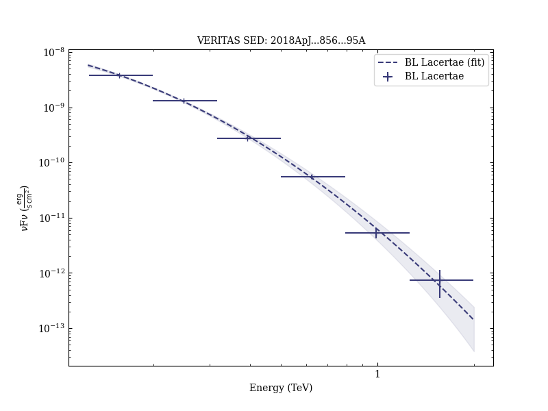
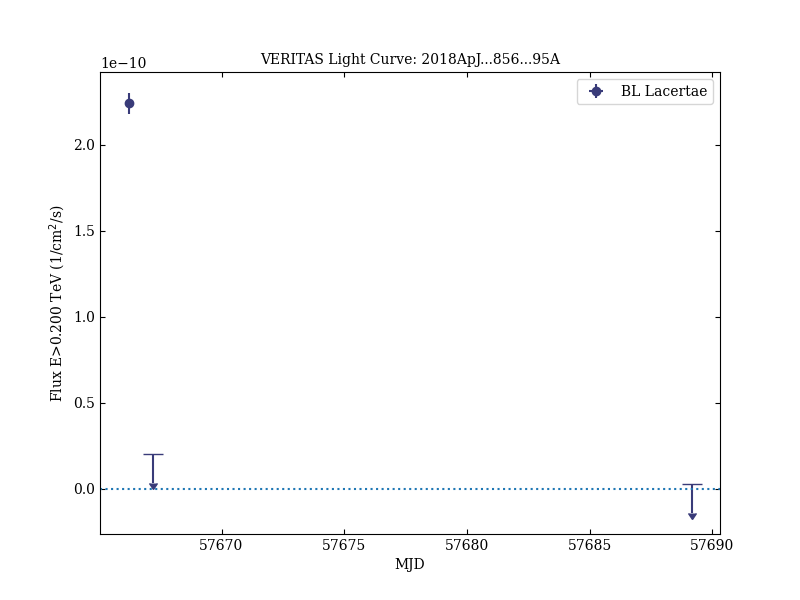

# Multiwavelength Observations of the Blazar BL Lacertae: A New Fast TeV Gamma-Ray Flare

Reference:
Abeysekara, A. U. et al. (The VERITAS Collaboration), The Astrophysical Journal, 856, 95 (2018)

- ADS: [2018ApJ...856...95A](http://adsabs.harvard.edu/abs/2018ApJ...856...95A)
- DOI: [10.3847/1538-4357/aab35c](https://doi.org/10.3847/1538-4357/aab35c)

## BL Lacertae
### Data files

- observation data: [VER-000148.yaml](VER-000148.yaml)  
- spectral data: [VER-000148-sed-1.ecsv](VER-000148-sed-1.ecsv)  
- light-curve data: [VER-000148-lc-1.ecsv](VER-000148-lc-1.ecsv)  [VER-000148-lc-2.ecsv](VER-000148-lc-2.ecsv)  [VER-000148-lc-3.ecsv](VER-000148-lc-3.ecsv)  
- observation data and fit results: [VER-000148.yaml](VER-000148.yaml)  

### Figures

