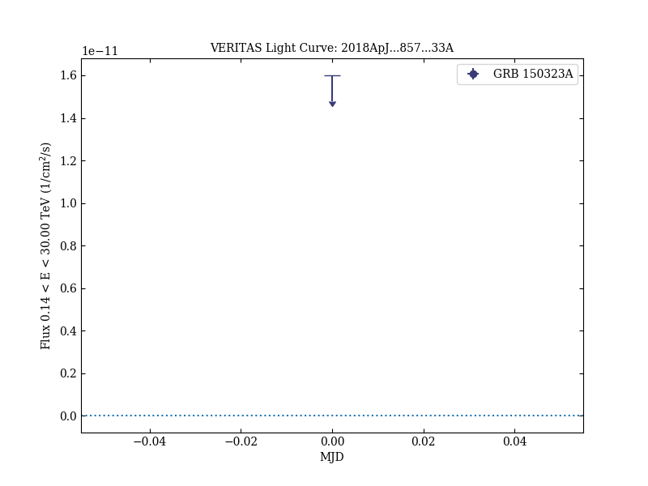

# A Strong Limit on the Very-high-energy Emission from GRB 150323A

Reference:
Abeysekara, A. U. et al. (The VERITAS Collaboration), The Astrophysical Journal, 857, 33 (2018)

- ADS: [2018ApJ...857...33A](http://adsabs.harvard.edu/abs/2018ApJ...857...33A)
- DOI: [10.3847/1538-4357/aab371](https://doi.org/10.3847/1538-4357/aab371)

## GRB 150323A
### Data files

- observation data: [VER-100172-1.yaml](VER-100172-1.yaml)
- light-curve data: [VER-100172-lc.ecsv](VER-100172-lc.ecsv)
- observation data and fit results: [VER-100172-1.yaml](VER-100172-1.yaml)

### Figures

