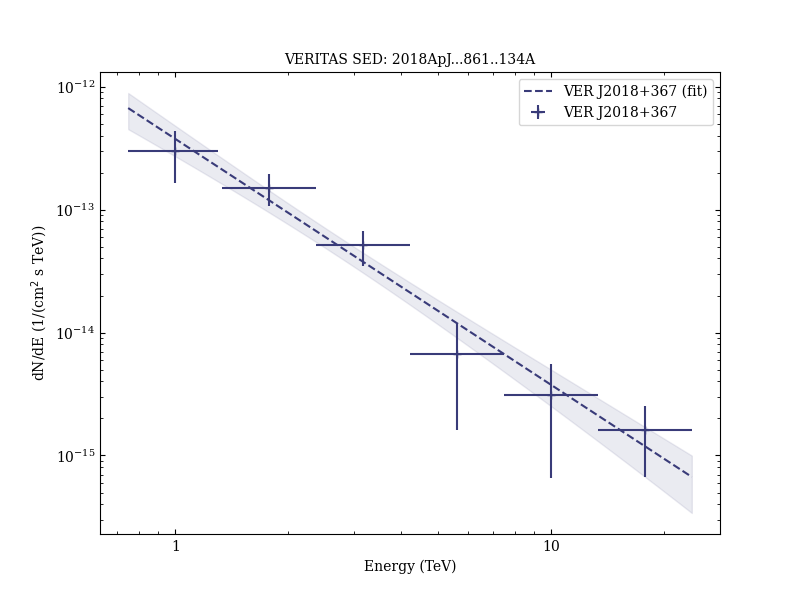
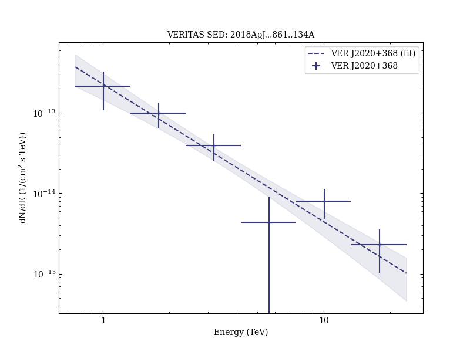

# A Very High Energy γ-Ray Survey toward the Cygnus Region of the Galaxy

Reference:
Abeysekara, A. U. et al. (The VERITAS Collaboration), The Astrophysical Journal, 861, 134 (2018)

- ADS: [2018ApJ...861..134A](http://adsabs.harvard.edu/abs/2018ApJ...861..134A)
- DOI: [10.3847/1538-4357/aac4a2](https://doi.org/10.3847/1538-4357/aac4a2)

### Data tables

- data tables: [VER-ULs-table-1.ecsv](VER-ULs-table-1.ecsv)  
## Gamma Cygni (VER J2019+407)
### Data files

- observation data: [VER-000144.yaml](VER-000144.yaml)  
- spectral data: [VER-000144-sed.ecsv](VER-000144-sed.ecsv)  
- observation data and fit results: [VER-000144.yaml](VER-000144.yaml)  

### Figures

## TeV J2032+4130 (VER J2031+415)
### Data files

- observation data: [VER-000146.yaml](VER-000146.yaml)  
- spectral data: [VER-000146-sed.ecsv](VER-000146-sed.ecsv)  
- observation data and fit results: [VER-000146.yaml](VER-000146.yaml)  

### Figures

## VER J2016+371
### Data files

- observation data: [VER-000141.yaml](VER-000141.yaml)  
- spectral data: [VER-000141-sed.ecsv](VER-000141-sed.ecsv)  
- observation data and fit results: [VER-000141.yaml](VER-000141.yaml)  

### Figures

## VER J2019+368
### Data files

- observation data: [VER-000143.yaml](VER-000143.yaml)  
- spectral data: [VER-000143-sed.ecsv](VER-000143-sed.ecsv)  
- observation data and fit results: [VER-000143.yaml](VER-000143.yaml)  

### Figures

## VER J2018+367
### Data files

- observation data: [VER-000170.yaml](VER-000170.yaml)  
- spectral data: [VER-000170-sed.ecsv](VER-000170-sed.ecsv)  
- observation data and fit results: [VER-000170.yaml](VER-000170.yaml)  

### Figures

## VER J2020+368
### Data files

- observation data: [VER-000171.yaml](VER-000171.yaml)  
- spectral data: [VER-000171-sed.ecsv](VER-000171-sed.ecsv)  
- observation data and fit results: [VER-000171.yaml](VER-000171.yaml)  

### Figures

