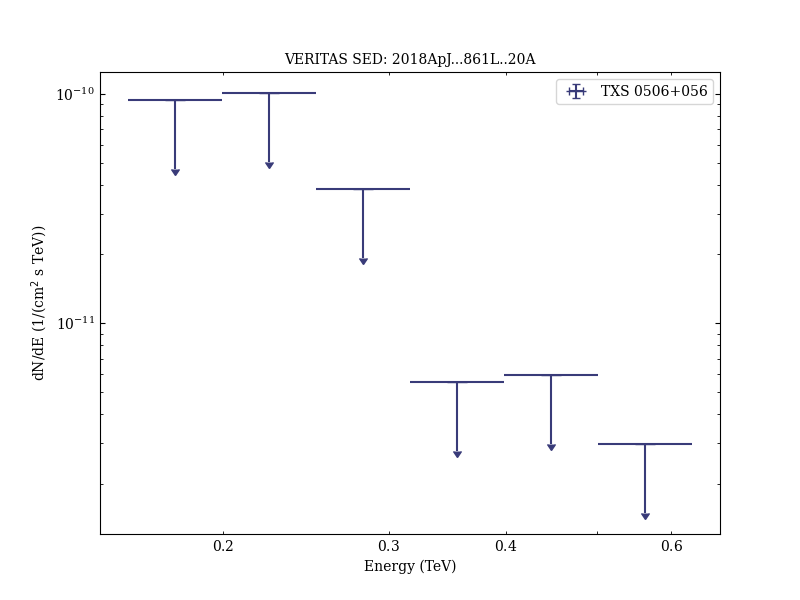
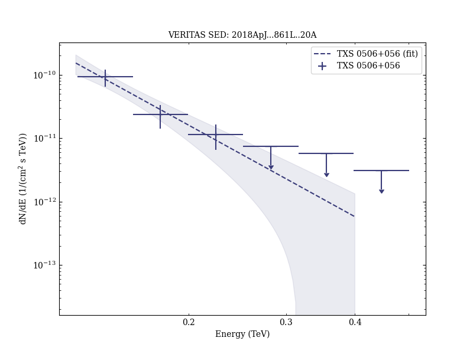

# VERITAS Observations of the BL Lac Object TXS 0506+056

Reference:
Abeysekara, A. U. et al. (The VERITAS Collaboration), The Astrophysical Journal, 861, L20 (2018)

- ADS: [2018ApJ...861L..20A](http://adsabs.harvard.edu/abs/2018ApJ...861L..20A)
- DOI: [10.3847/2041-8213/aad053](https://doi.org/10.3847/2041-8213/aad053)

## TXS 0506+056 (VER J0509+057)
### Data files

- observation data: [VER-000168.yaml](VER-000168.yaml)  
- spectral data: [VER-000168-sed-1.ecsv](VER-000168-sed-1.ecsv)  [VER-000168-sed-2.ecsv](VER-000168-sed-2.ecsv)  
- light-curve data: [VER-000168-lc.ecsv](VER-000168-lc.ecsv)  
- observation data and fit results: [VER-000168.yaml](VER-000168.yaml)  
- FITS data: [VER-000168-signif-skymap.fits](VER-000168-signif-skymap.fits)  

### Figures

