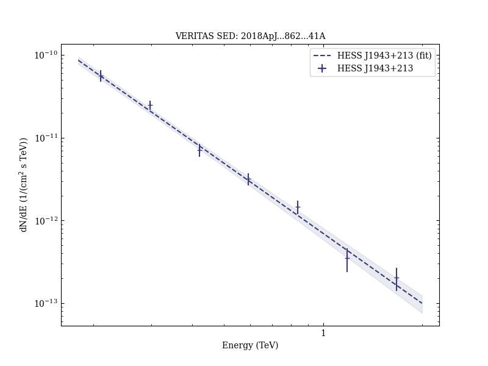

# HESS J1943+213: An Extreme Blazar Shining through the Galactic Plane

Reference:
Archer, A. et al. (The VERITAS Collaboration), The Astrophysical Journal, 862, 41 (2018)

- ADS: [2018ApJ...862...41A](http://adsabs.harvard.edu/abs/2018ApJ...862...41A)
- DOI: [10.3847/1538-4357/aacbd0](https://doi.org/10.3847/1538-4357/aacbd0)

## HESS J1943+213 (VER J1943+213)
### Data files

- observation data: [VER-000137-1.yaml](VER-000137-1.yaml)  [VER-000137-2.yaml](VER-000137-2.yaml)  [VER-000137-3.yaml](VER-000137-3.yaml)  
- spectral data: [VER-000137-sed-1.ecsv](VER-000137-sed-1.ecsv)  
- light-curve data: [VER-000137-lc.ecsv](VER-000137-lc.ecsv)  
- observation data and fit results: [VER-000137-1.yaml](VER-000137-1.yaml)  [VER-000137-2.yaml](VER-000137-2.yaml)  [VER-000137-3.yaml](VER-000137-3.yaml)  

### Figures

