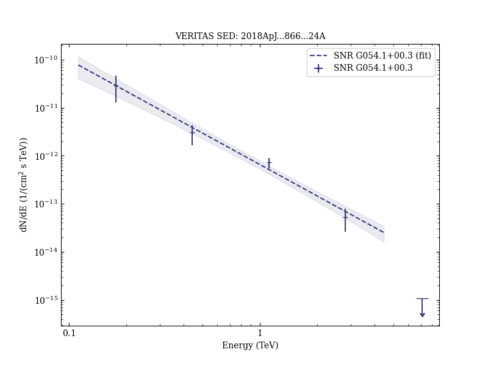

# VERITAS and Fermi-LAT Observations of TeV Gamma-Ray Sources Discovered by HAWC in the 2HWC Catalog

Reference:
Abeysekara, A. U. et al. (The VERITAS, HAWC, and FERMI-LAT Collaborations), The Astrophysical Journal, 866, 24 (2018)

- ADS: [2018ApJ...866...24A](http://adsabs.harvard.edu/abs/2018ApJ...866...24A)
- DOI: [10.3847/1538-4357/aade4e](https://doi.org/10.3847/1538-4357/aade4e)

### Data tables

- data tables: [VER-ULs-table-1.ecsv](VER-ULs-table-1.ecsv)  
## SNR G054.1+00.3 (VER J1930+188)
### Data files

- observation data: [VER-000136-1.yaml](VER-000136-1.yaml)  
- spectral data: [VER-000136-sed-1.ecsv](VER-000136-sed-1.ecsv)  
- observation data and fit results: [VER-000136-1.yaml](VER-000136-1.yaml)  

### Figures

