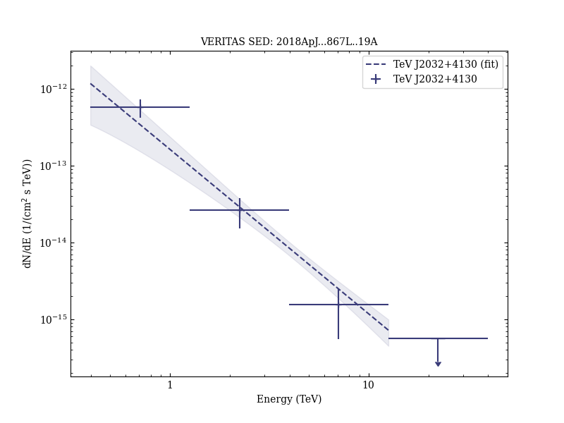
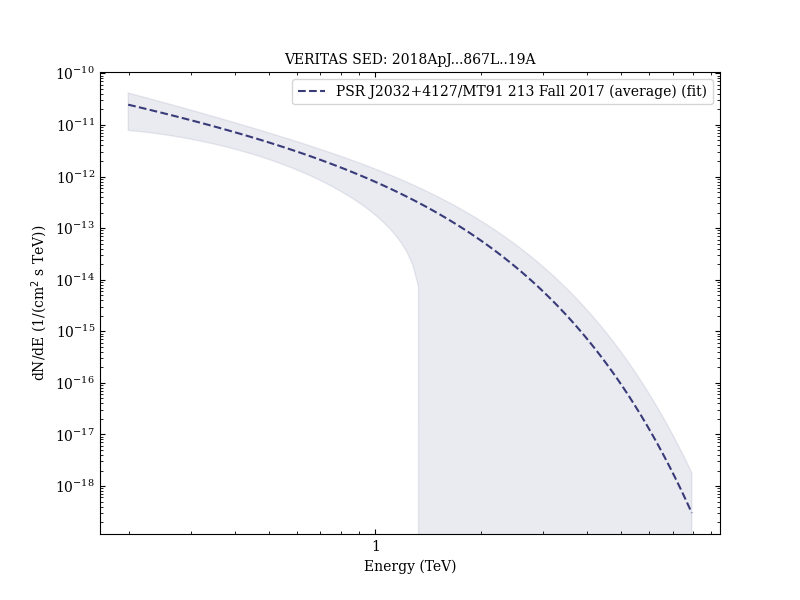
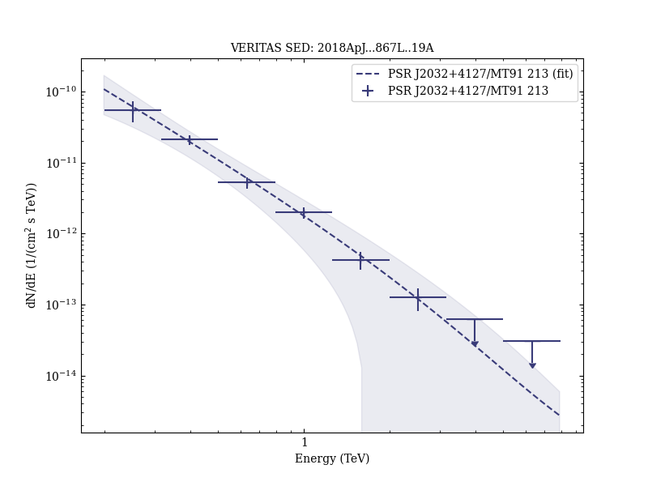
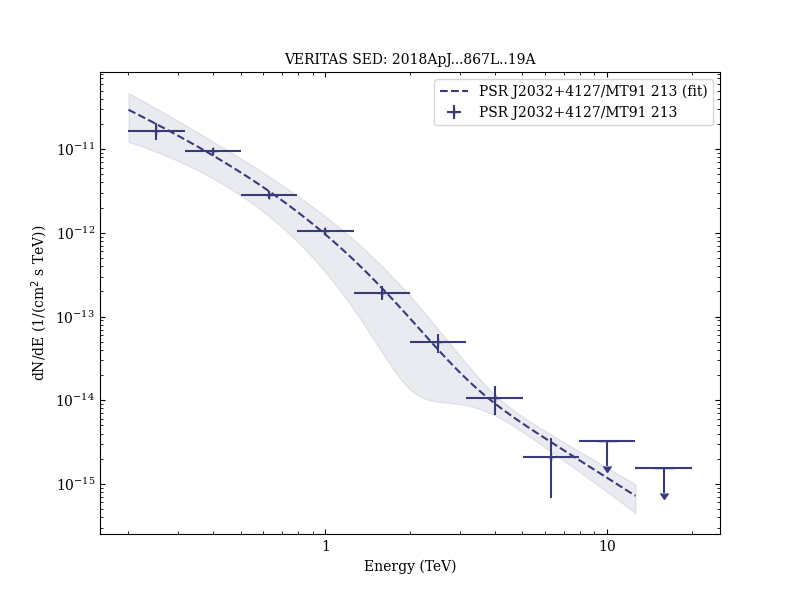
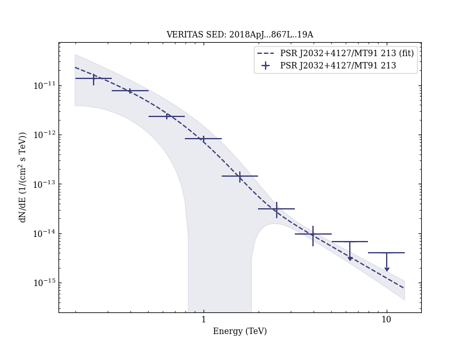

# Periastron Observations of TeV Gamma-Ray Emission from a Binary System with a 50-year Period

Reference:
Abeysekara, A. U. et al., The Astrophysical Journal, 867, L19 (2018)

- ADS: [2018ApJ...867L..19A](http://adsabs.harvard.edu/abs/2018ApJ...867L..19A)
- DOI: [10.3847/2041-8213/aae70e](https://doi.org/10.3847/2041-8213/aae70e)

### Data tables

- data tables: [VER-000146-spectralFits-table-1.ecsv](VER-000146-spectralFits-table-1.ecsv)## TeV J2032+4130 (VER J2031+415)
### Data files

- observation data: [VER-000146-1.yaml](VER-000146-1.yaml)
- spectral data: [VER-000146-sed-1.ecsv](VER-000146-sed-1.ecsv)
- observation data and fit results: [VER-000146-1.yaml](VER-000146-1.yaml)
- FITS data: [VER-000146-signif-skymap.fits](VER-000146-signif-skymap.fits)

### Figures

## PSR J2032+4127/MT91 213 (VER J2032+414)
### Data files

- observation data: [VER-000174-1.yaml](VER-000174-1.yaml)  [VER-000174-2.yaml](VER-000174-2.yaml)  [VER-000174-3.yaml](VER-000174-3.yaml)  [VER-000174-4.yaml](VER-000174-4.yaml)  [VER-000174-5.yaml](VER-000174-5.yaml)
- spectral data: [VER-000174-sed-4.ecsv](VER-000174-sed-4.ecsv)  [VER-000174-sed-5.ecsv](VER-000174-sed-5.ecsv)  [VER-000174-sed-3.ecsv](VER-000174-sed-3.ecsv)
- light-curve data: [VER-000174-lc-1.ecsv](VER-000174-lc-1.ecsv)  [VER-000174-lc-2.ecsv](VER-000174-lc-2.ecsv)
- observation data and fit results: [VER-000174-1.yaml](VER-000174-1.yaml)  [VER-000174-2.yaml](VER-000174-2.yaml)  [VER-000174-3.yaml](VER-000174-3.yaml)  [VER-000174-4.yaml](VER-000174-4.yaml)  [VER-000174-5.yaml](VER-000174-5.yaml)

### Figures

