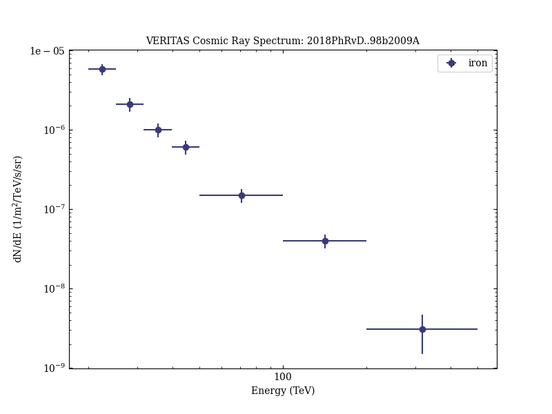

# Measurement of the iron spectrum in cosmic rays by VERITAS

Reference:
Archer, A. et al. (The VERITAS Collaboration), Physical Review D, 98, 022009 (2018)

- ADS: [2018PhRvD..98b2009A](http://adsabs.harvard.edu/abs/2018PhRvD..98b2009A)
- DOI: [10.1103/PhysRevD.98.022009](https://doi.org/10.1103/PhysRevD.98.022009)

## iron
### Data files

- observation data: [VER-300026-1.yaml](VER-300026-1.yaml)
- spectral data: [VER-300026-sedCR-1.ecsv](VER-300026-sedCR-1.ecsv)
- observation data and fit results: [VER-300026-1.yaml](VER-300026-1.yaml)

### Figures

