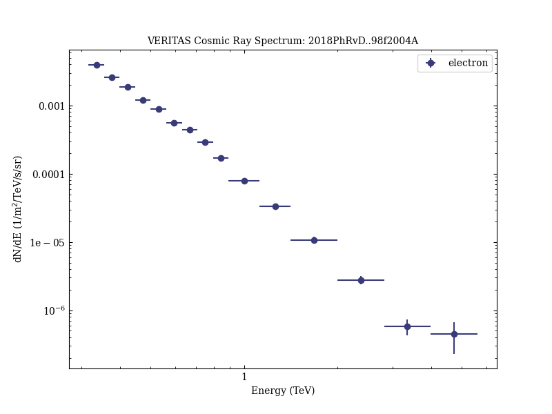

# Measurement of cosmic-ray electrons at TeV energies by VERITAS

Reference:
Archer, A. et al. (The VERITAS Collaboration), Physical Review D, 98, 062004 (2018)

- ADS: [2018PhRvD..98f2004A](http://adsabs.harvard.edu/abs/2018PhRvD..98f2004A)
- DOI: [10.1103/PhysRevD.98.062004](https://doi.org/10.1103/PhysRevD.98.062004)

## electron
### Data files

- observation data: [VER-300000-1.yaml](VER-300000-1.yaml)  
- spectral data: [VER-300000-sedCR-1.ecsv](VER-300000-sedCR-1.ecsv)  
- observation data and fit results: [VER-300000-1.yaml](VER-300000-1.yaml)  

### Figures

