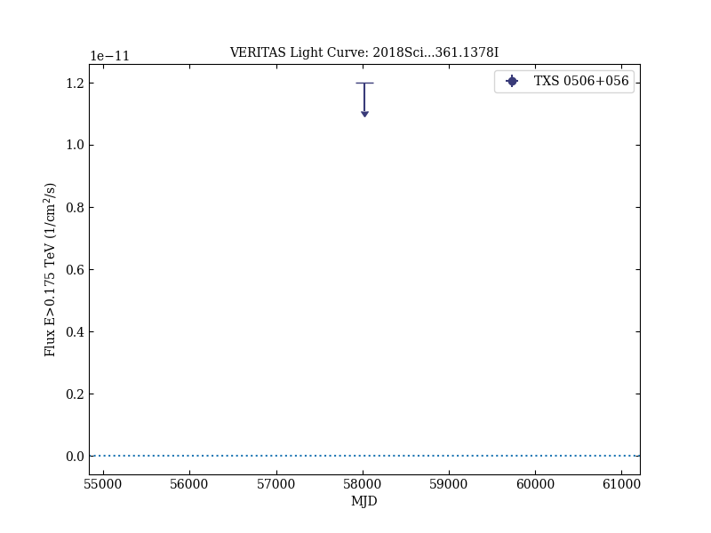
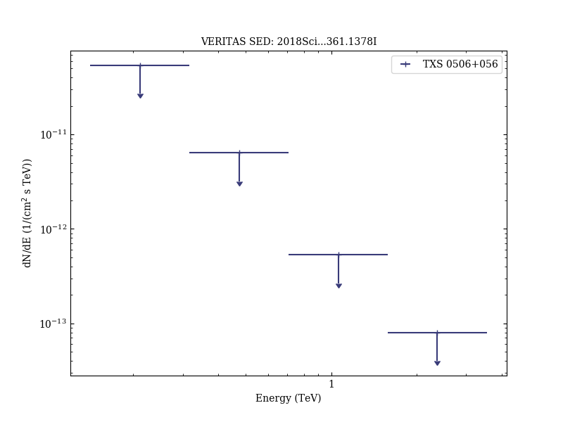
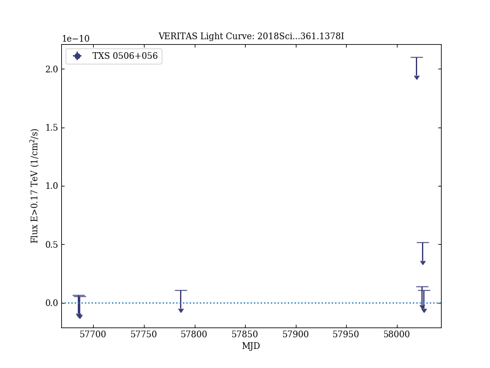

# Multimessenger observations of a flaring blazar coincident with high-energy neutrino IceCube-170922A

Reference:
IceCube Collaboration et al., Science, 361, eaat1378 (2018)

- ADS: [2018Sci...361.1378I](http://adsabs.harvard.edu/abs/2018Sci...361.1378I)
- DOI: [10.1126/science.aat1378](https://doi.org/10.1126/science.aat1378)

## TXS 0506+056 (VER J0509+057)
### Data files

- observation data: [VER-000168-1.yaml](VER-000168-1.yaml)
- spectral data: [VER-000168-sed-1.ecsv](VER-000168-sed-1.ecsv)
- light-curve data: [VER-000168-lc-1.ecsv](VER-000168-lc-1.ecsv)  [VER-000168-lc-2.ecsv](VER-000168-lc-2.ecsv)
- observation data and fit results: [VER-000168-1.yaml](VER-000168-1.yaml)

### Figures

