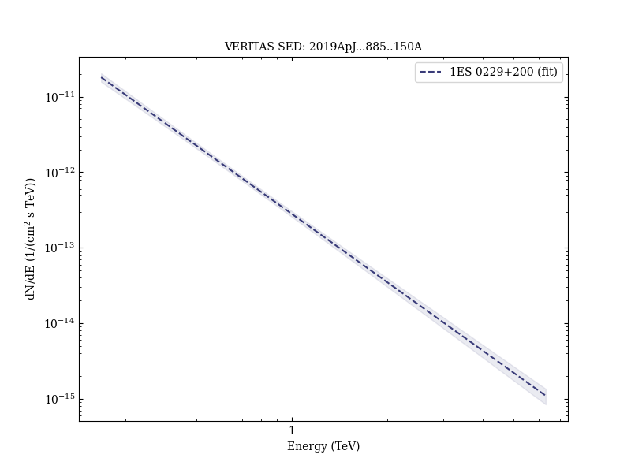
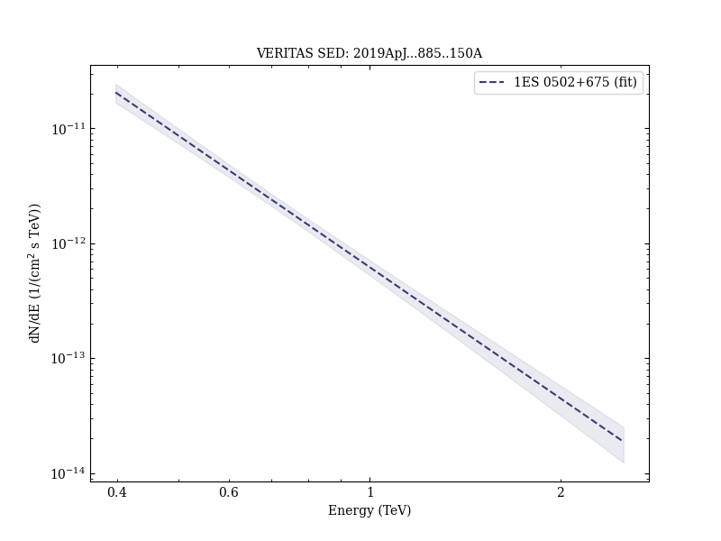
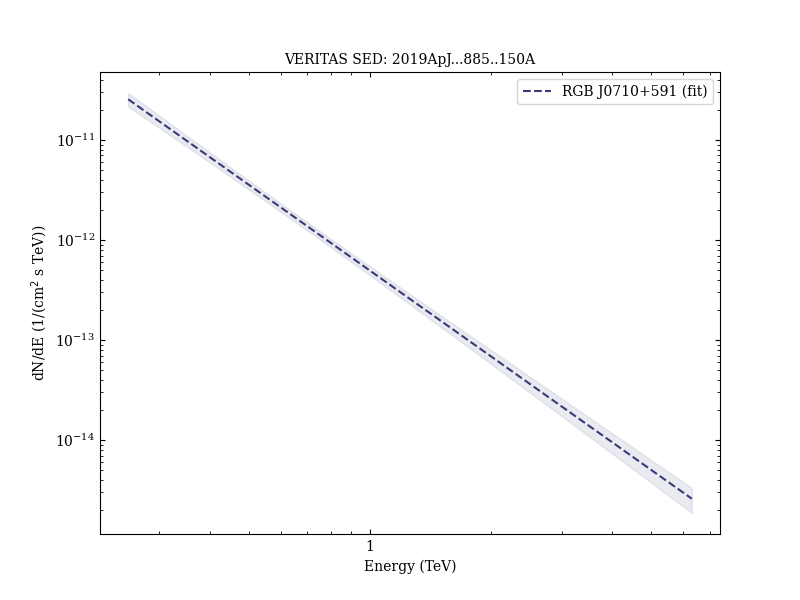
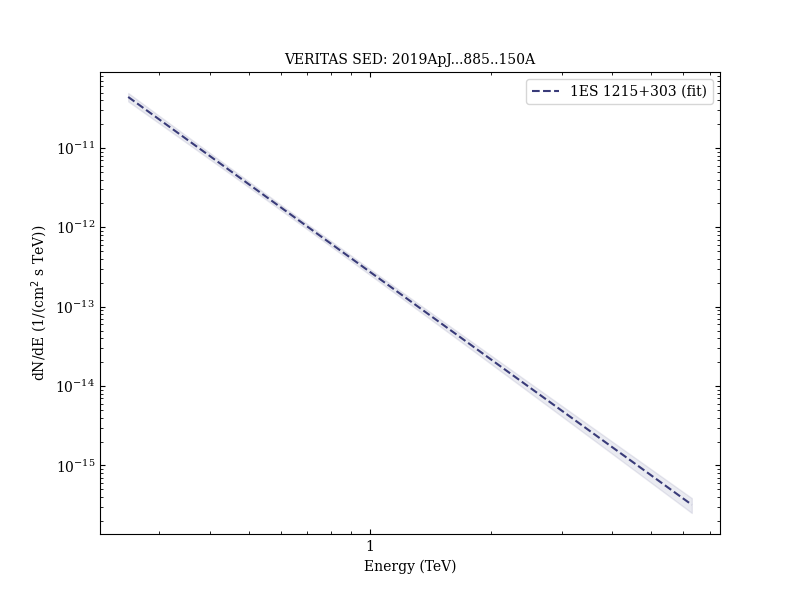
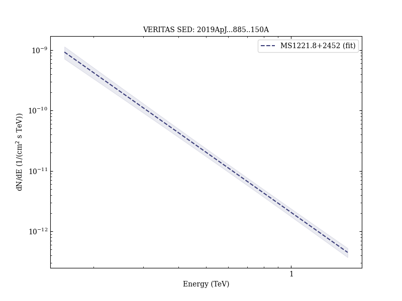
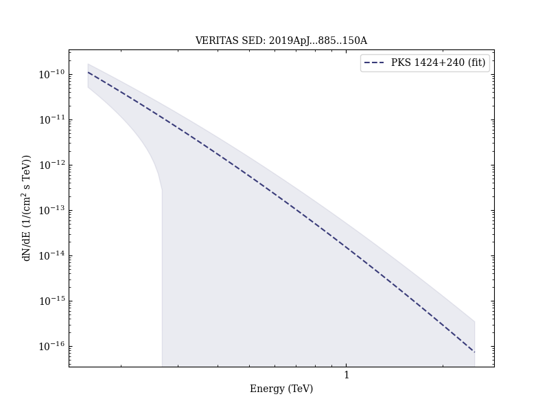
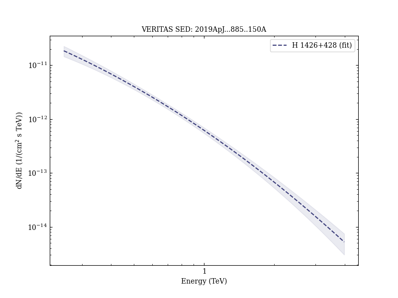
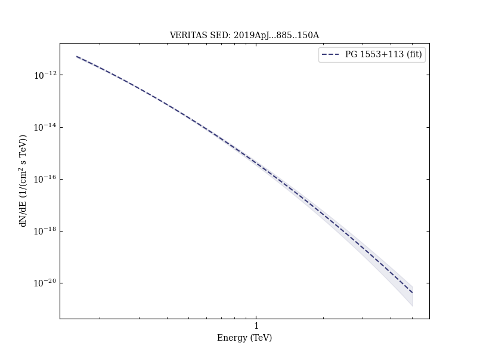
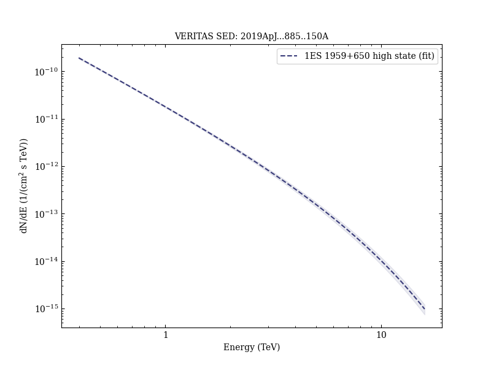

# Measurement of the Extragalactic Background Light Spectral Energy Distribution with VERITAS

Reference:
Abeysekara, A. U. et al. (The VERITAS Collaboration), The Astrophysical Journal, 885, 150 (2019)

- ADS: [2019ApJ...885..150A](http://adsabs.harvard.edu/abs/2019ApJ...885..150A)
- DOI: [10.3847/1538-4357/ab4817](https://doi.org/10.3847/1538-4357/ab4817)

### Data tables

- data tables: [VER-EBLIntensity-table-1.ecsv](VER-EBLIntensity-table-1.ecsv)  
## 3C 66A
### Data files

- observation data: [VER-000011-1.yaml](VER-000011-1.yaml)  [VER-000011-2.yaml](VER-000011-2.yaml)  [VER-000011-3.yaml](VER-000011-3.yaml)  
- observation data and fit results: [VER-000011-1.yaml](VER-000011-1.yaml)  [VER-000011-2.yaml](VER-000011-2.yaml)  [VER-000011-3.yaml](VER-000011-3.yaml)  

### Figures

## 1ES 0229+200 (VER J0232+202)
### Data files

- observation data: [VER-000013-1.yaml](VER-000013-1.yaml)  
- observation data and fit results: [VER-000013-1.yaml](VER-000013-1.yaml)  

### Figures

## 1ES 0414+009 (VER J0416+011)
### Data files

- observation data: [VER-000020-1.yaml](VER-000020-1.yaml)  
- observation data and fit results: [VER-000020-1.yaml](VER-000020-1.yaml)  

### Figures

## 1ES 0502+675
### Data files

- observation data: [VER-000022-1.yaml](VER-000022-1.yaml)  
- observation data and fit results: [VER-000022-1.yaml](VER-000022-1.yaml)  

### Figures

## RGB J0710+591 (VER J0710+591)
### Data files

- observation data: [VER-000034-1.yaml](VER-000034-1.yaml)  
- observation data and fit results: [VER-000034-1.yaml](VER-000034-1.yaml)  

### Figures

## 1ES 1011+496
### Data files

- observation data: [VER-000043-1.yaml](VER-000043-1.yaml)  
- observation data and fit results: [VER-000043-1.yaml](VER-000043-1.yaml)  

### Figures

## 1ES 1215+303 (VER J1217+301)
### Data files

- observation data: [VER-000053-1.yaml](VER-000053-1.yaml)  
- observation data and fit results: [VER-000053-1.yaml](VER-000053-1.yaml)  

### Figures

## 1ES 1218+304 (VER J1221+301)
### Data files

- observation data: [VER-000055-1.yaml](VER-000055-1.yaml)  
- observation data and fit results: [VER-000055-1.yaml](VER-000055-1.yaml)  

### Figures

## MS1221.8+2452
### Data files

- observation data: [VER-000057-1.yaml](VER-000057-1.yaml)  
- observation data and fit results: [VER-000057-1.yaml](VER-000057-1.yaml)  

### Figures

## PKS 1424+240 (VER J1427+237)
### Data files

- observation data: [VER-000067-1.yaml](VER-000067-1.yaml)  
- observation data and fit results: [VER-000067-1.yaml](VER-000067-1.yaml)  

### Figures

## H 1426+428
### Data files

- observation data: [VER-000069-1.yaml](VER-000069-1.yaml)  
- observation data and fit results: [VER-000069-1.yaml](VER-000069-1.yaml)  

### Figures

## PG 1553+113 (VER J1555+111)
### Data files

- observation data: [VER-000082-1.yaml](VER-000082-1.yaml)  
- observation data and fit results: [VER-000082-1.yaml](VER-000082-1.yaml)  

### Figures

## 1ES 1959+650 (VER J1959+651)
### Data files

- observation data: [VER-000138-1.yaml](VER-000138-1.yaml)  [VER-000138-2.yaml](VER-000138-2.yaml)  [VER-000138-3.yaml](VER-000138-3.yaml)  
- observation data and fit results: [VER-000138-1.yaml](VER-000138-1.yaml)  [VER-000138-2.yaml](VER-000138-2.yaml)  [VER-000138-3.yaml](VER-000138-3.yaml)  

### Figures

## 1ES 2344+514 (VER J2347+517)
### Data files

- observation data: [VER-000154-1.yaml](VER-000154-1.yaml)  
- observation data and fit results: [VER-000154-1.yaml](VER-000154-1.yaml)  

### Figures

