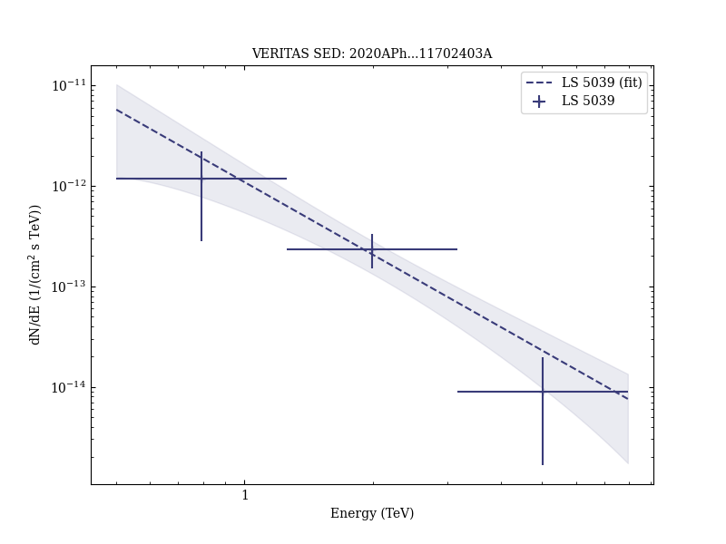
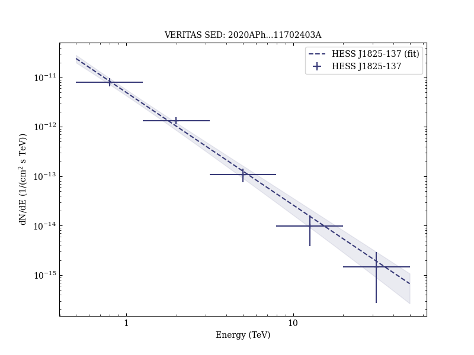

# VERITAS Detection of LS 5039 and HESS J1825-137

Reference:
Abeysekara, A. U. et al. (The VERITAS Collaboration), Astroparticle Physics, 117, 102403 (2020)

- ADS: [2020APh...11702403A](http://adsabs.harvard.edu/abs/2020APh...11702403A)
- DOI: [10.1016/j.astropartphys.2019.102403](https://doi.org/10.1016/j.astropartphys.2019.102403)

## LS 5039 (VER J1826-148)
### Data files

- observation data: [VER-000119-1.yaml](VER-000119-1.yaml)  [VER-000119-2.yaml](VER-000119-2.yaml)  [VER-000119-3.yaml](VER-000119-3.yaml)  
- spectral data: [VER-000119-sed-2.ecsv](VER-000119-sed-2.ecsv)  [VER-000119-sed-3.ecsv](VER-000119-sed-3.ecsv)  
- observation data and fit results: [VER-000119-1.yaml](VER-000119-1.yaml)  [VER-000119-2.yaml](VER-000119-2.yaml)  [VER-000119-3.yaml](VER-000119-3.yaml)  

### Figures

## HESS J1825-137 (VER J1825-138)
### Data files

- observation data: [VER-000118-1.yaml](VER-000118-1.yaml)  
- spectral data: [VER-000118-sed-1.ecsv](VER-000118-sed-1.ecsv)  
- observation data and fit results: [VER-000118-1.yaml](VER-000118-1.yaml)  

### Figures

